# LAPR3 - 2021/2022

-----------------------------


-----------------------------

#### Team Macchiato js _ Class DE:
* 1200720 _ Manuela Leite
* 1201239 _ Francisco Redol
* 1201382 _ Pedro Rocha
* 1201386 _ Rita Ariana Sobral

#### Teachers/Advisors:

* Nuno Bettencourt (NMB)
* José Marinho (JSM)
* António Silva Pereira (AMP)
* Orlando Sousa (OMS)
* Carlos Augusto Ramos (CAR)

#### Client:

* Nuno Bettencourt (NMB)

#### Course Unit:

* Laboratório/Projeto LAPR3

-----------------------------
# Document division

This document is divided in different categories, being them:

1. Software Engineering
   1. Use Case Diagram
   2. Requirements Engineering:
      1. System Sequence Diagram (SSD) for each user story.
   3. Engineering Analysis:
      1. Domain Model (whole project)
      2. Excerpts of each User Story.
   4. Engineering Design 
      1. Class Diagram (CD) for the whole project. 
         1. Excerpts of each user story 
      2. Sequence Diagram (SD) for each user story 
      3. Relational Model (Normalised) for the whole project
3. Report
    1. Problem Statement
    2. Project Division Organization
    3. Solution
    4. Project Coverage
    5. Pit Test Coverage Report
    6. Team Performance
4. README

-------------

# Software Engineering

## Requirements Engineering
####  System Sequence Diagram (SSD) for each user story
###### US101 - SSD

###### US102 - SSD

###### US103 - SSD
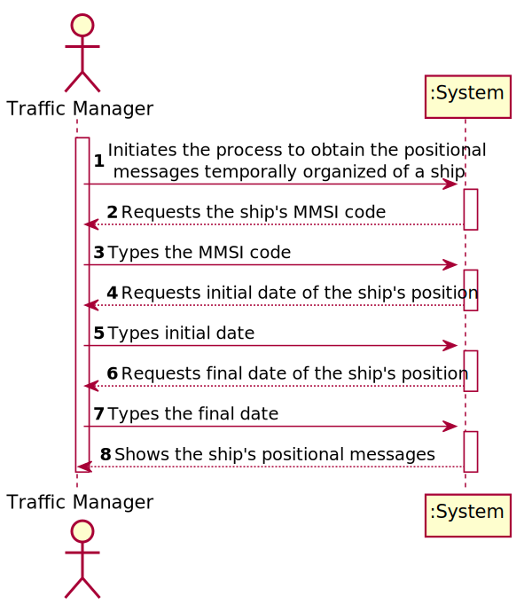
###### US104 - SSD
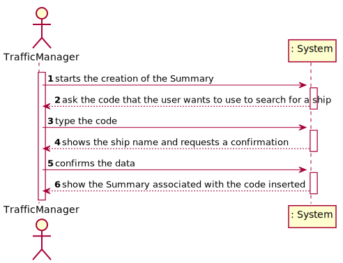
###### US105 - SSD
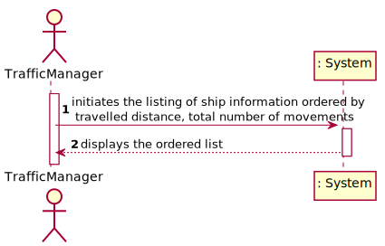
###### US106 - SSD
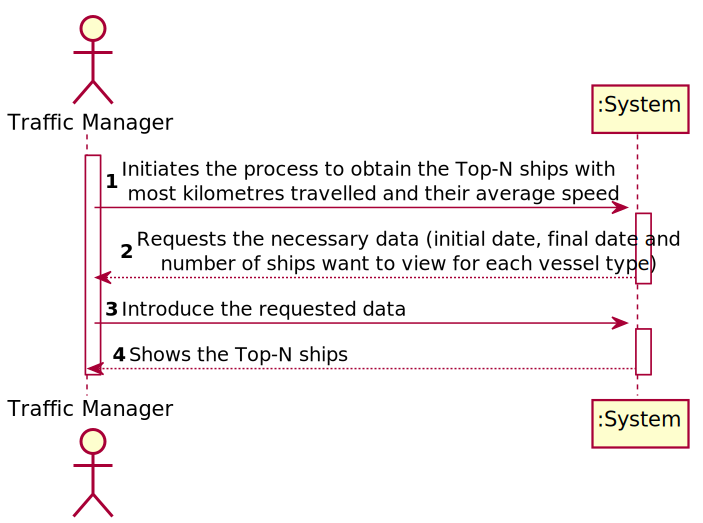
###### US107 - SSD
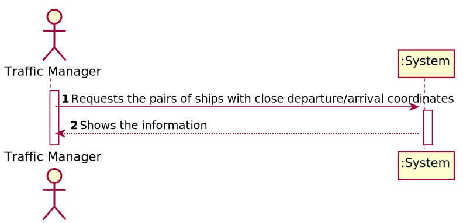

## Engineering Analysis:
#### Domain Model (whole project)
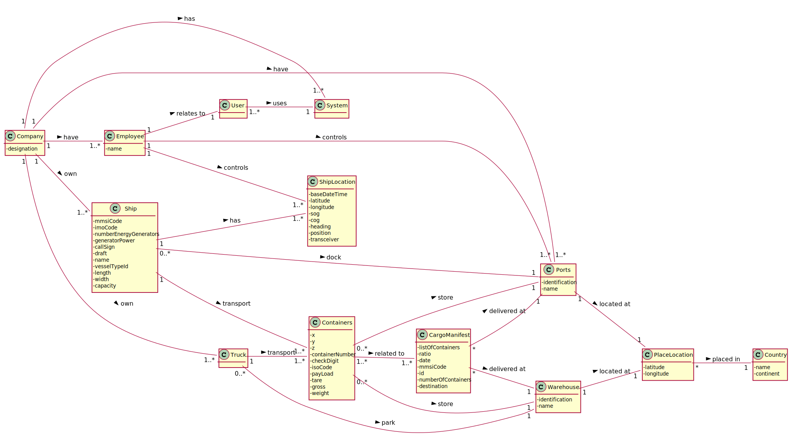
###### Excerpts of each User Story
######  US101 - DM

###### US102 - DM
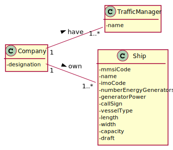
###### US103 - DM
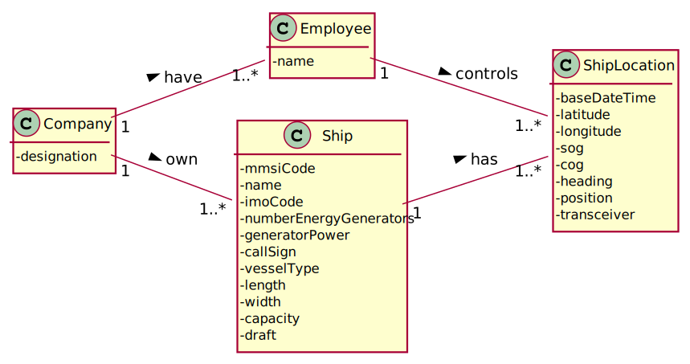
###### US104 - DM
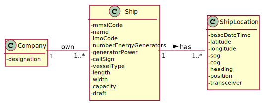
###### US105 - DM
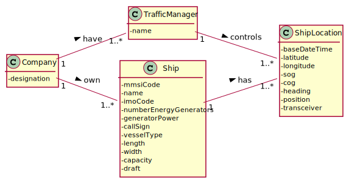
###### US106 - DM

###### US107 - DM


## Engineering Design
#### Class Diagram (CD) for the whole project.
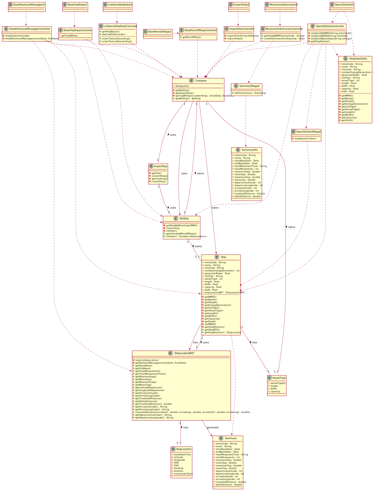
###### Excerpts of each user story
###### US101 - CD

###### US102 - CD
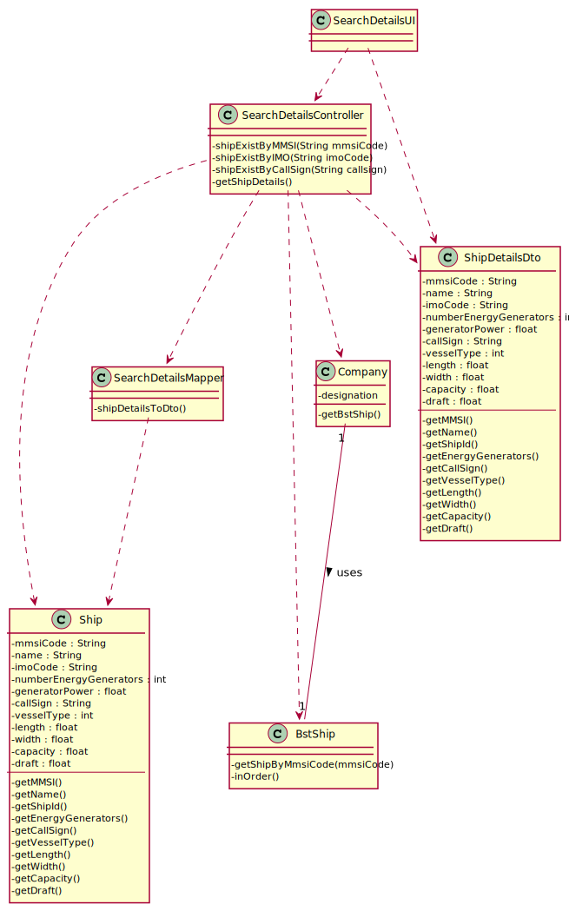
###### US103 - CD
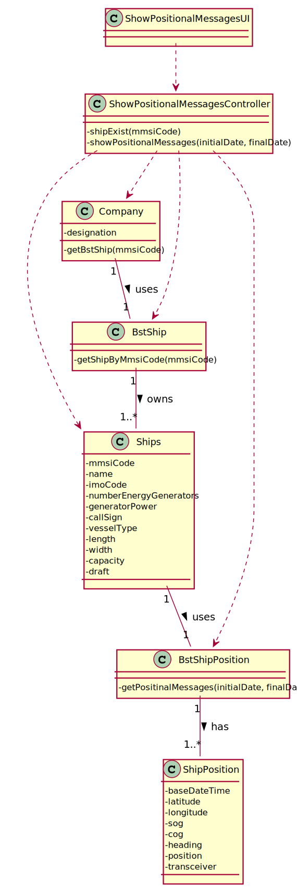
###### US104 - CD
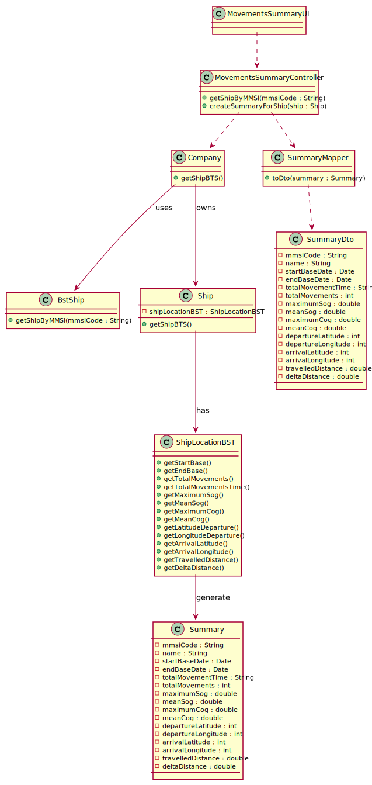
###### US105 - CD
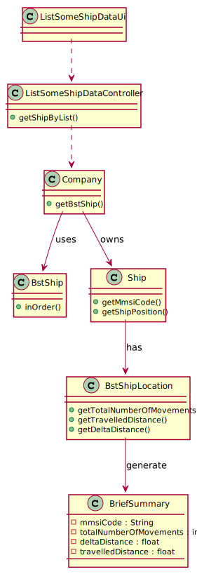
###### US106 - CD
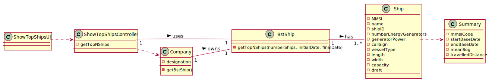
###### US107 - CD
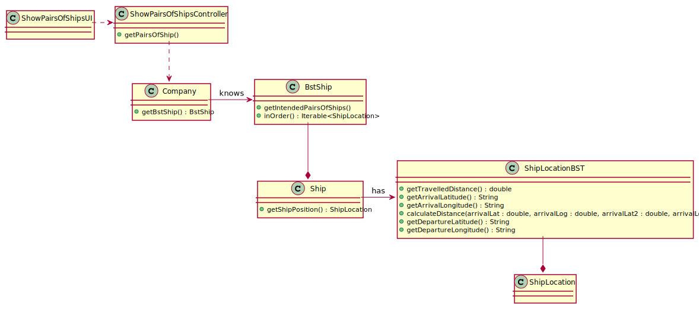

#### Sequence Diagram (SD) for each user story
###### US101 - SD

###### US102 - SD
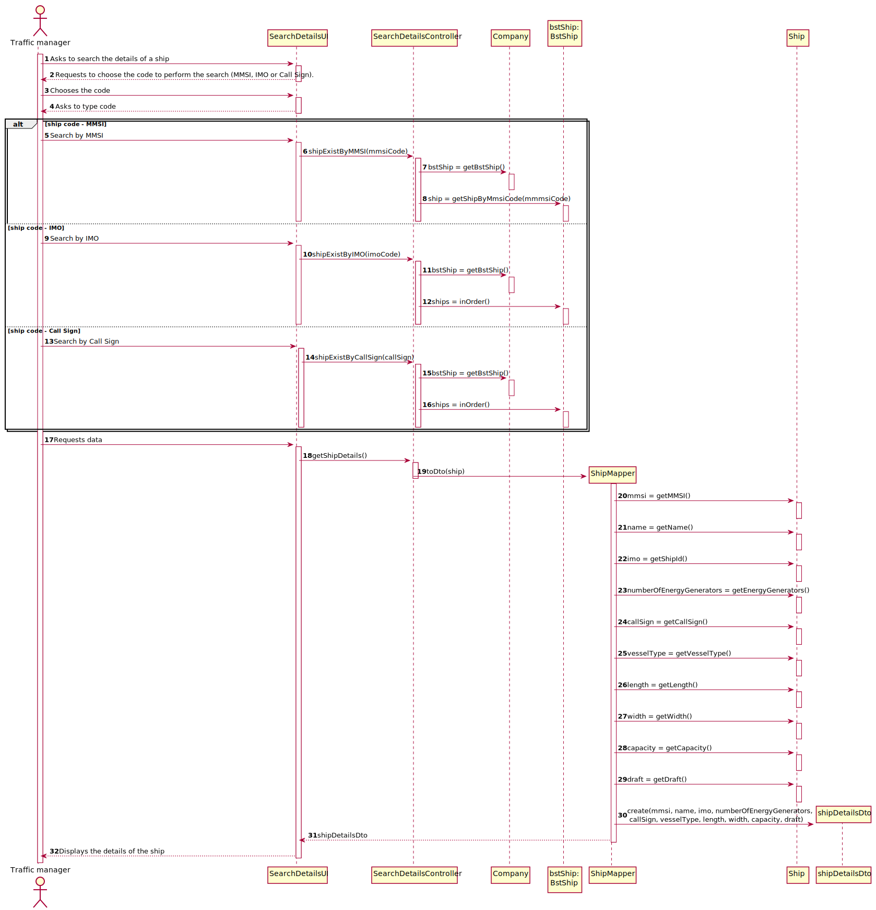
###### US103 - SD
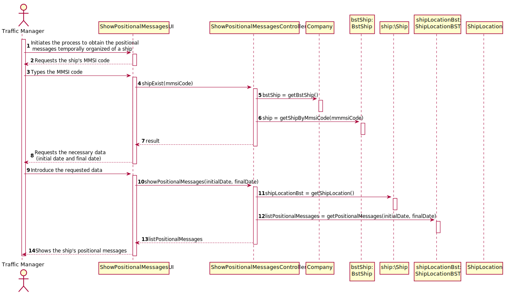
###### US104 - SD
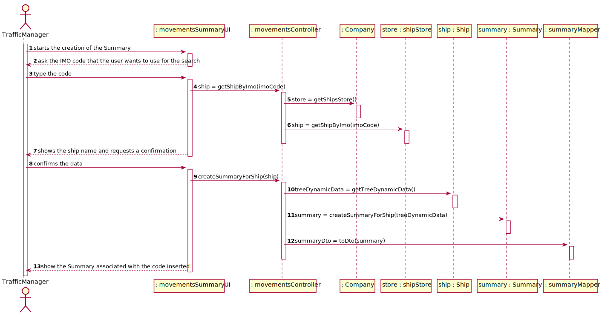
###### US105 - SD
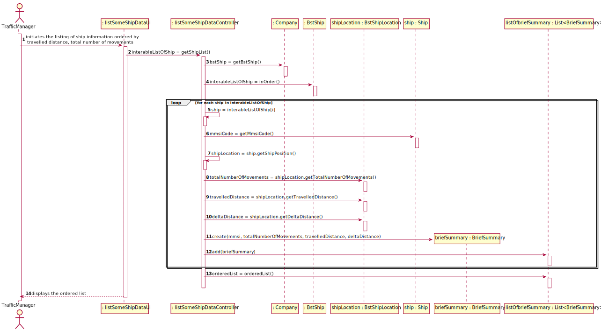
###### US106 - SD
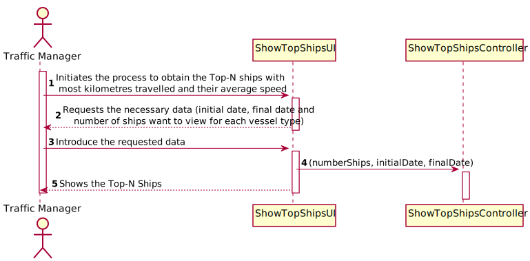
###### US107 - SD
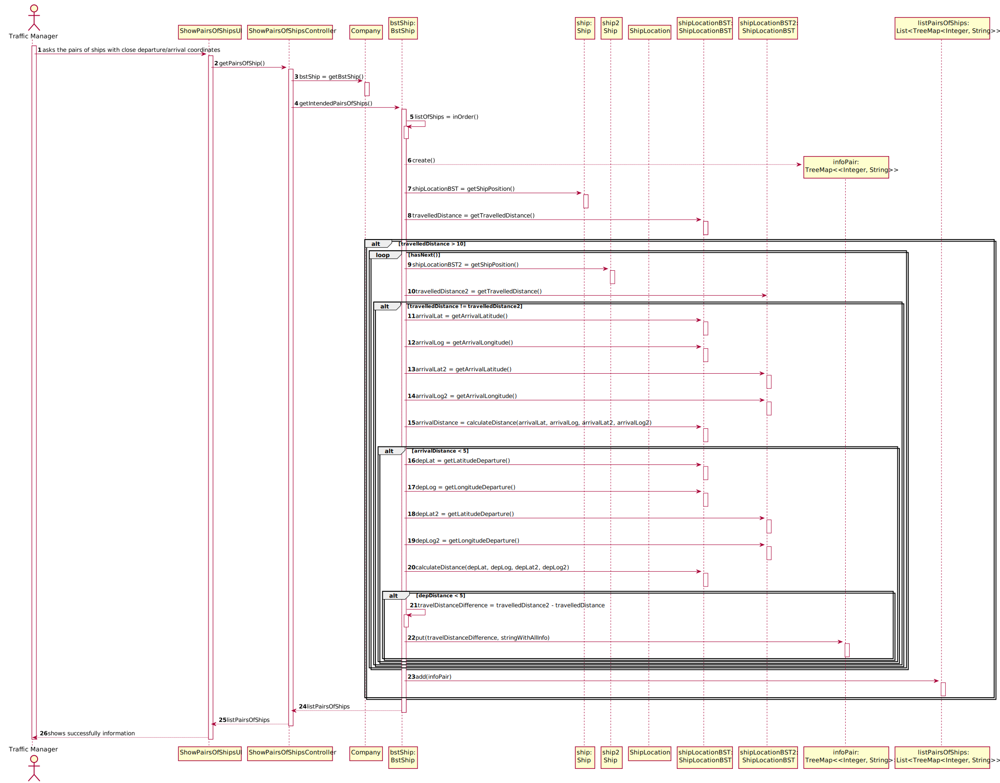


#### Relational Model (Normalised) for the whole project

----------------------

# Report

## Abstract

This project portraits everything the students learned during the semester and the results reflect the performance by each member of the team.

The project assignment presents the development of a software product for cargo shipping company to handle their logistics. This company operates through land and sea, across different
continents and has several warehouses spread along the world.

It was divided in 4 sprints to help us organize everything and each sprint had its own use cases.

## Introduction

This project has the goal to put into practice the good pratices learned on the differents course units: Applied Physics (FSIAP), Computer Architecture (ARQCP), Data
Structures (ESINF) and Databases (BDDAD), and Laboratory/Project III (LAPR3). An iterative and incremental process applies.

An agile methodology based on Scrum must be applied to manage each team’s work during each three-week sprint.

The main goal was to create a product that will be use to manage the logistics of a shipping company that operates across different continents through land and sea and the own several warehouses.

The software is developed in Java, and  some other software used for quick notifications should be developed in C/Assembly. The data should persist in a Database(SQL).


## Problem Statement
In response to LAPR3 Project Assignment, we had to develop a software for cargo shipping company to manage their logistics.
The company operates through land and sea, across different continents and has several warehouses spread along the world.
It should allow the Traffic Manager to import ships, see Ships's different data and create summary's.


##  Projet Division Organization
####  US101 - Francisco Redol
####  US102 - Pedro Rocha
####  US103 - Rita Ariana Sobral
####  US104 - Manuela Leite
####  US105 - Manuela Leite & Pedro Rocha
####  US106 - Rita Ariana Sobral & Francisco Redol
####  US107 - Manuela Leite, Francisco Redol, Pedro Rocha & Rita Ariana Sobral
####  US108 - Rita Ariana Sobral & Francisco Redol
####  US109 - Manuela Leite & Francisco Redol
####  US110 - Manuela Leite & Pedro Rocha
####  US111 - Rita Ariana Sobral & Pedro Rocha

## Solution

For LAPR3, the goal of the ride-sharing system was to develop a software solution capable of managing users, as well as allowing administrators to control all of its vehicles (bicycles and Scooters) and vehicle parks, including the pickup and return processes.

To reach this goal, we were instructed to adopt a Test-Driven-Development during the project, use Java, and follow an agile Scrum Methodology aswell as Jira. We we're also required to apply the knowledge acquired in Information Structures and Database unit courses, in order to fully develop all of the requested functionalities.

Jira was used to create issues and tasks, aswell as dividing them and planning each Sprint. Each user story was created and assigned to a team member(s), with focus on:
Analysis, where it was developed the Use Case Diagram and the System Sequence Diagram.
Design, where it was developed the Class Diagram, Sequence Diagram.
Implementation, where code and test code were implemented.
Review, where it was possible to review the entire implementation.

## Project Coverage

## Pit Test Coverage Report

## Team Performance

-----------------
# README

This is the repository template used for student repositories in LAPR Projets.

## Java source files

Java source and test files are located in folder src.

## Maven file

Pom.xml file controls the project build.

### Notes
In this file, DO NOT EDIT the following elements:

* groupID
* artifactID
* version
* properties

Beside, students can only add dependencies to the specified section of this file.

## Eclipse files

The following files are solely used by Eclipse IDE:

* .classpath
* .project

## IntelliJ Idea IDE files

The following folder is solely used by Intellij Idea IDE :

* .idea

# How was the .gitignore file generated?
.gitignore file was generated based on https://www.gitignore.io/ with the following keywords:

  - Java
  - Maven
  - Eclipse
  - NetBeans
  - Intellij

# Who do I talk to?
In case you have any problem, please email Nuno Bettencourt (nmb@isep.ipp.pt).

# How do I use Maven?

## How to run unit tests?

Execute the "test" goals.

```shell
$ mvn test
```
## How to generate the javadoc for source code?

Execute the "javadoc:javadoc" goal.

```shell
$ mvn javadoc:javadoc
```
This generates the source code javadoc in folder "target/site/apidocs/index.html".

## How to generate the javadoc for test cases code?

Execute the "javadoc:test-javadoc" goal.

```shell
$ mvn javadoc:test-javadoc
```
This generates the test cases javadoc in folder "target/site/testapidocs/index.html".

## How to generate Jacoco's Code Coverage Report?

Execute the "jacoco:report" goal.

```shell
$ mvn test jacoco:report
```

This generates a jacoco code coverage report in folder "target/site/jacoco/index.html".

## How to generate PIT Mutation Code Coverage?

Execute the "org.pitest:pitest-maven:mutationCoverage" goal.

```shell
$ mvn test org.pitest:pitest-maven:mutationCoverage
```
This generates a PIT Mutation coverage report in folder "target/pit-reports/YYYYMMDDHHMI".

## How to combine different maven goals in one step?

You can combine different maven goals in the same command. For example, to locally run your project just like on jenkins, use:

```shell
$ mvn clean test jacoco:report org.pitest:pitest-maven:mutationCoverage
```
## How to perform a faster pit mutation analysis?

Do not clean build => remove "clean"

Reuse the previous report => add "-Dsonar.pitest.mode=reuseReport"

Use more threads to perform the analysis. The number is dependent on each computer CPU => add "-Dthreads=4"

Temporarily remove timestamps from reports.

Example:
```shell
$ mvn test jacoco:report org.pitest:pitest-maven:mutationCoverage -DhistoryInputFile=target/fasterPitMutationTesting-history.txt -DhistoryOutputFile=target/fasterPitMutationTesting-history.txt -Dsonar.pitest.mode=reuseReport -Dthreads=4 -DtimestampedReports=false
```
## Where do I configure my database connection?

Each group should configure their database connection on the file:
* src/main/resources/application.properties