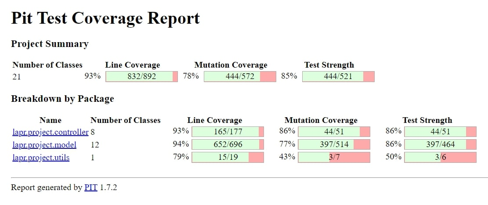

# LAPR3 - 2021/2022

-----------------------------


-----------------------------

#### Team Macchiato js _ Class DE:
* 1200720 _ Manuela Leite
* 1201239 _ Francisco Redol
* 1201382 _ Pedro Rocha
* 1201386 _ Rita Ariana Sobral

#### Teachers/Advisors:
* Nuno Bettencourt (NMB)
* José Marinho (JSM)
* António Silva Pereira (AMP)
* Orlando Sousa (OMS)
* Carlos Augusto Ramos (CAR)

#### Client:
* Nuno Bettencourt (NMB)

#### Course Unit:
* Laboratório/Projeto LAPR3

-----------------------------
# Document division

This document is divided in different categories, being them:

1. Report
   1. Problem Statement
   2. Project Division Organization
   3. Solution
   4. Software Engineering
      1. Use Case Diagram
      2. Domain Model
      3. Class Diagram (CD) for the whole project.
      4. For each US:
         1. Requirements Engineering:
            1. System Sequence Diagram (SSD).
         2. Engineering Analysis:
            1. Domain Model.
         3. Engineering Design
            1. Class Diagram (CD)
            2. Sequence Diagram (SD)
      5. Decision Making
      6. Complexity Analysis
   5. Coverage
      1. Project Coverage
      2. Pit Test Coverage Report
   6. Team Performance
2. README

-----------------------------

# Report

## Abstract

This project portraits everything the students learned during the semester and the results reflect the performance by each member of the team.

The project assignment presents the development of a software product for cargo shipping company to handle their logistics. This company operates through land and sea, across different
continents and has several warehouses spread along the world.

It was divided in 4 sprints to help us organize everything and each sprint had its own use cases.

## Introduction

This project has the goal to put into practice the good pratices learned on the differents course units: Applied Physics (FSIAP), Computer Architecture (ARQCP), Data
Structures (ESINF) and Databases (BDDAD), and Laboratory/Project III (LAPR3). An iterative and incremental process applies.

An agile methodology based on Scrum must be applied to manage each team’s work during each three-week sprint.

The main goal was to create a product that will be use to manage the logistics of a shipping company that operates across different continents through land and sea and the own several warehouses.

The software is developed in Java, and  some other software used for quick notifications should be developed in C/Assembly. The data should persist in a Database(SQL).


## Problem Statement
In response to LAPR3 Project Assignment, we had to develop a software for cargo shipping company to manage their logistics.
The company operates through land and sea, across different continents and has several warehouses spread along the world.
It should allow the Traffic Manager to import ships, see Ships's different data and create summary's.


##  Projet Division Organization
####  US101 - Francisco Redol
####  US102 - Pedro Rocha
####  US103 - Rita Ariana Sobral
####  US104 - Manuela Leite
####  US105 - Manuela Leite & Pedro Rocha
####  US106 - Rita Ariana Sobral & Francisco Redol
####  US107 - Manuela Leite, Francisco Redol, Pedro Rocha & Rita Ariana Sobral
####  US108 - Rita Ariana Sobral & Francisco Redol
####  US109 - Manuela Leite & Francisco Redol
####  US110 - Manuela Leite & Pedro Rocha
####  US111 - Rita Ariana Sobral & Pedro Rocha

## Solution

For LAPR3, the goal is to develop a software for a cargo shipping company to handle their logistics.

To reach this goal, we were instructed to adopt a Test-Driven-Development during the project, use Java, and follow an agile Scrum Methodology aswell as Jira.
We we're also required to apply the knowledge acquired in Information Structures and Database unit courses, in order to fully develop all the requested functionalities.

Jira was used to create issues and tasks, aswell as dividing them and planning each Sprint. Each user story was created and assigned to a team member(s), with focus on:
* Analysis, where it was developed the Use Case Diagram and the System Sequence Diagram.
* Design, where it was developed the Class Diagram, Sequence Diagram.
* Implementation, where code and test code were implemented.
* Review, where it was possible to review the entire implementation.

## Software Engineering

* [Use Case Diagram](https://bitbucket.org/lei-isep/lapr3-2021-g042/src/master/docs/UCD.svg)

* [Domain Model](https://bitbucket.org/lei-isep/lapr3-2021-g042/src/master/docs/DM.svg)

* [Class Diagram](https://bitbucket.org/lei-isep/lapr3-2021-g042/src/master/docs/CD.svg)


| **_US_**  | **_DESCRIPTION_** | **_ACCEPTANCE CRITERIA_**|                                       
|:---------------:|:--------------------:|:---------------------------|
| **[US101](https://bitbucket.org/lei-isep/lapr3-2021-g042/src/master/docs/US101/US101.md)** | **As a traffic manager, I which to import ships from a text file into a BST.** | No data lost.|
| **[US102](https://bitbucket.org/lei-isep/lapr3-2021-g042/src/master/docs/US102/US102.md)** | **As a traffic manager I which to search the details of a ship using any of its codes: MMSI, IMO or Call Sign.** | Correct use of OOP concepts.|
| **[US103](https://bitbucket.org/lei-isep/lapr3-2021-g042/src/master/docs/US103/US103.md)** | **As a traffic manager I which to have the positional messages temporally organized and associated with each of the ships** | Efficient access of any position value(s) of a ship on a period or date.|
| **[US104](https://bitbucket.org/lei-isep/lapr3-2021-g042/src/master/docs/US104/US104.md)** | **As a traffic manager I which to make a Summary of a ship's movements.** | For a given ship return in an appropriate structure one of its codes (MMSI, IMO or Call Sign), Vessel Name, Start Base Date Time, End Base Date Time, Total Movement Time, Total Number of Movements, Max SOG, Mean SOG, Max COG, Mean COG, Departure Latitude, Departure Longitude, Arrival Latitude, Arrival Longitude, Travelled Distance (incremental sum of the distance between each positioning message) and Delta Distance (linear distance between the coordinates of the first and last move).| 
| **[US105](https://bitbucket.org/lei-isep/lapr3-2021-g042/src/master/docs/US105/US105.md)** | **As a traffic manager I which to list for all ships the MMSI, the total number of movements, Travelled Distance and Delta Distance.** | ordered by Travelled Distance and total number of movements(descending/ascending).|
| **[US106](https://bitbucket.org/lei-isep/lapr3-2021-g042/src/master/docs/US106/US106.md)** | **Get the top-N ships with the most kilometres travelled and their average speed (MeanSOG).** | In a period (initial/final Base Date Time) grouped by Vessel Type.|
| **[US107](https://bitbucket.org/lei-isep/lapr3-2021-g042/src/master/docs/US107/US107.md)** | **Return pairs of ships with routes with close departure/arrival coordinates (no more than 5 Kms away) and with different Travelled Distance.** | Sorted by the MMSI code of the 1st ship and in descending order of the Travelled Distance difference. Do not consider ships with Travelled Distance less than 10 kms.|
| **[US108]()** | **As Project Manager, I want the team to develop the data model required to support all the functionality and to fulfill the purpose of the system to develop. This data model is to be designed following a systematic data modeling methodology.** | The result should include (1) the conceptual data model, (2) the logical data model according to the database technology to use, (3) the physical data model to be implemented at the selected DBMS, (4) a data dictionary describing the relevant details of the database elements and (5) a clear and concise justification supporting the selected database technology. It is possible to run a SQL script to create the database schema in a complete and consistent way without errors. The data models generated at each one of the three abstraction levels (conceptual, logical, and physical) map only the meaningful concepts and characteristics in compliance with the corresponding level. Each one of the data models respects the former one, i.e., the logical data model respects the conceptual data model, and the physical data model respects the logical data model. The conceptual data model is a valid view/representation of the UoD. The notation used for each one of the data models is adequate, consistent, and following the specification|
| **[US109]()** | **As Project Manager, I want the team to draft an SQL script to test whether the database verifies all the data integrity restrictions that are required to fulfil the purpose of the system and the business constraints of the UoD.** | There is a catalogue of data integrity restrictions grouped by type (Domain, Identity, Referential, Application) clearly stated. For each data integrity restriction in the catalogue there is a set of SQL instructions that verify the restriction.  All SQL instruction in the data integrity verification script are accompanied by a comment that describes the expected result (Pass or Fail; in the latter a justification is given).|
| **[US110]()** | **As Project Manager, I want the team to define the naming conventions to apply when defining identifiers or writing SQL or PL/SQL code. The naming conventions may evolve as new database and programming objects are known. The naming conventions guide should be organized in a way to facilitate its maintenance** | There are naming conventions clearly stated to create databases and database objects. The minimum set includes tables, attributes, constraints, primary and foreign keys. The naming conventions are available in a way that makes them easy to understand and complete in a continuous way |
| **[US111]()** | **As Project Manager, I want the team to create a SQL script to load the database with a minimum set of data sufficient to carry out data integrity verification and functional testing. This script shall produce a bootstrap report providing the number of tuples/rows in each relation/table.** | The bootstrap SQL script runs and loads the database as expected with no errors, The bootstrap report is generated and correct, i.e., all tables are mentioned, and their cardinality is correct. |
| **[US201]()** | **As a Port manager, I which to import ports from a text file and create a 2D-tree with port locations.** | 2D-tree balanced. |
| **[US202]()** | **As a Traffic manager, I which to find the closest port of a ship given its CallSign, on a certain DateTime.** | using 2D-tree to find closest port. |
| **[US203]()** | **As Project Manager, I want the team to review the relational data model in view of the new user stories so it can support all the requirements to fulfil the purpose of the system being developed.** | The following deliverables are expected: (1) revised relational data model in 3NF, (2) revised SQL script to create the database schema in Oracle (physical data model) and (3) database bootstrap script. It is possible to run a SQL script to create the database schema in a complete and consistent way without errors. It is possible to run a script to load the database with enough data to explore the database and run the user stories (database bootstrap script). |
| **[US204]()** | **As Client, I want to know the current situation of a specific container being used to transport my goods.** | Clients provide the container identifier and get the type and the concrete instance of its current location, e.g., PORT, Leixões or SHIP, WeFly.|
| **[US205]()** | **As Ship Captain, I want the list of containers to be offloaded in the next port, including container identifier, type, position, and load.** | “next port” is properly identified. The containers being offloaded are properly identified. Output is in accordance with the specification wrt the information about each container. |
| **[US206]()** | **As Ship Captain, I want the list of containers to be loaded in the next port, including container identifier, type, and load.** | “next port” is properly identified. The containers being loaded are properly identified. Output is in accordance with the specification wrt the information about each container. |
| **[US207]()** | **As Ship Captain, I want to know how many cargo manifests I have transported during a given year and the average number of containers per manifest.** | Only the cargo manifests of the specified year are considered. Average containers per cargo manifest are properly computed. |
| **[US208]()** | **As Ship Captain, I want to know the occupancy rate (percentage) of a given ship for a given cargo manifest. Occupancy rate is the ratio between total number of containers in the ship coming from a given manifest and the total capacity of the ship, i.e., the maximum number of containers the ship can load.** | Ship and cargo manifest are correctly identified. Occupancy rate is properly computed.|
| **[US209]()** | **As Ship Captain, I want to know the occupancy rate of a given ship at a given moment.** | Ship is properly identified. Reuses US208. Occupancy rate is properly computed |
| **[US210]()** | **As Traffic manager, I need to know which ships will be available on Monday next week and their location.** | Monday next week is properly identified. Only available ships are returned. All available ships are returned.|


## Project Coverage


## Pit Test Coverage Report


## Team Performance
The group agrees that all members of the group contributed equally to the project, althought some focused more on other parts given the division of the project.

-----------------
# README

This is the repository template used for student repositories in LAPR Projets.

## Java source files

Java source and test files are located in folder src.

## Maven file

Pom.xml file controls the project build.

### Notes
In this file, DO NOT EDIT the following elements:

* groupID
* artifactID
* version
* properties

Beside, students can only add dependencies to the specified section of this file.

## Eclipse files

The following files are solely used by Eclipse IDE:

* .classpath
* .project

## IntelliJ Idea IDE files

The following folder is solely used by Intellij Idea IDE :

* .idea

# How was the .gitignore file generated?
.gitignore file was generated based on https://www.gitignore.io/ with the following keywords:

- Java
- Maven
- Eclipse
- NetBeans
- Intellij

# Who do I talk to?
In case you have any problem, please email Nuno Bettencourt (nmb@isep.ipp.pt).

# How do I use Maven?

## How to run unit tests?

Execute the "test" goals.

```shell
$ mvn test
```
## How to generate the javadoc for source code?

Execute the "javadoc:javadoc" goal.

```shell
$ mvn javadoc:javadoc
```
This generates the source code javadoc in folder "target/site/apidocs/index.html".

## How to generate the javadoc for test cases code?

Execute the "javadoc:test-javadoc" goal.

```shell
$ mvn javadoc:test-javadoc
```
This generates the test cases javadoc in folder "target/site/testapidocs/index.html".

## How to generate Jacoco's Code Coverage Report?

Execute the "jacoco:report" goal.

```shell
$ mvn test jacoco:report
```

This generates a jacoco code coverage report in folder "target/site/jacoco/index.html".

## How to generate PIT Mutation Code Coverage?

Execute the "org.pitest:pitest-maven:mutationCoverage" goal.

```shell
$ mvn test org.pitest:pitest-maven:mutationCoverage
```
This generates a PIT Mutation coverage report in folder "target/pit-reports/YYYYMMDDHHMI".

## How to combine different maven goals in one step?

You can combine different maven goals in the same command. For example, to locally run your project just like on jenkins, use:

```shell
$ mvn clean test jacoco:report org.pitest:pitest-maven:mutationCoverage
```
## How to perform a faster pit mutation analysis?

Do not clean build => remove "clean"

Reuse the previous report => add "-Dsonar.pitest.mode=reuseReport"

Use more threads to perform the analysis. The number is dependent on each computer CPU => add "-Dthreads=4"

Temporarily remove timestamps from reports.

Example:
```shell
$ mvn test jacoco:report org.pitest:pitest-maven:mutationCoverage -DhistoryInputFile=target/fasterPitMutationTesting-history.txt -DhistoryOutputFile=target/fasterPitMutationTesting-history.txt -Dsonar.pitest.mode=reuseReport -Dthreads=4 -DtimestampedReports=false
```
## Where do I configure my database connection?

Each group should configure their database connection on the file:
* src/main/resources/application.properties