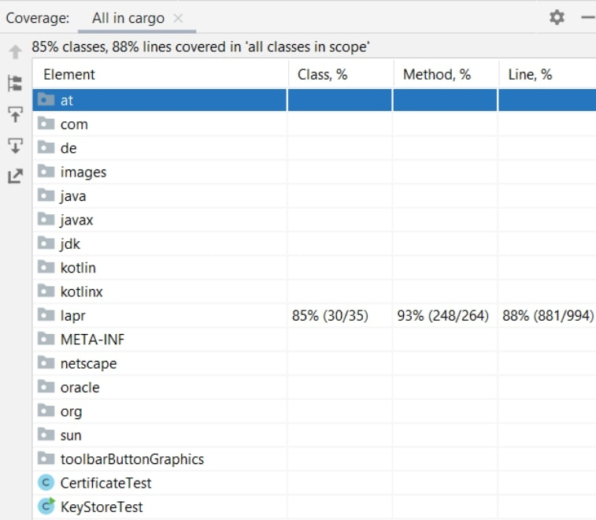
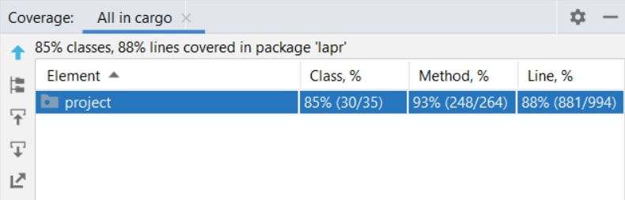
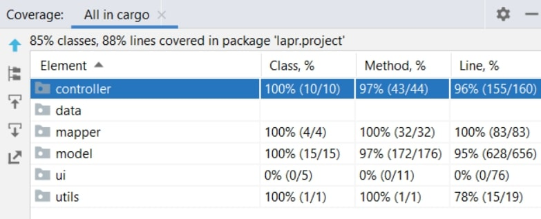
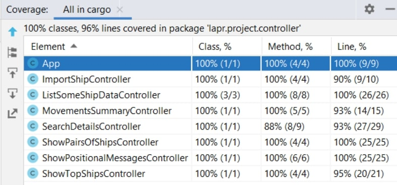
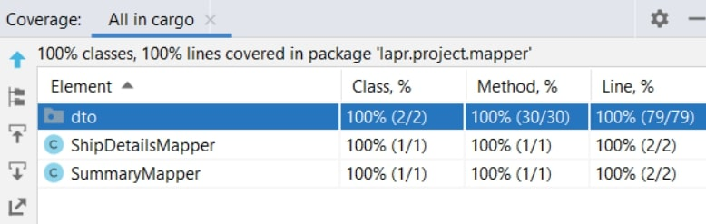
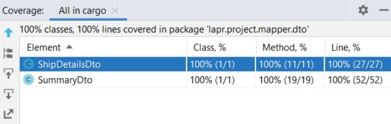
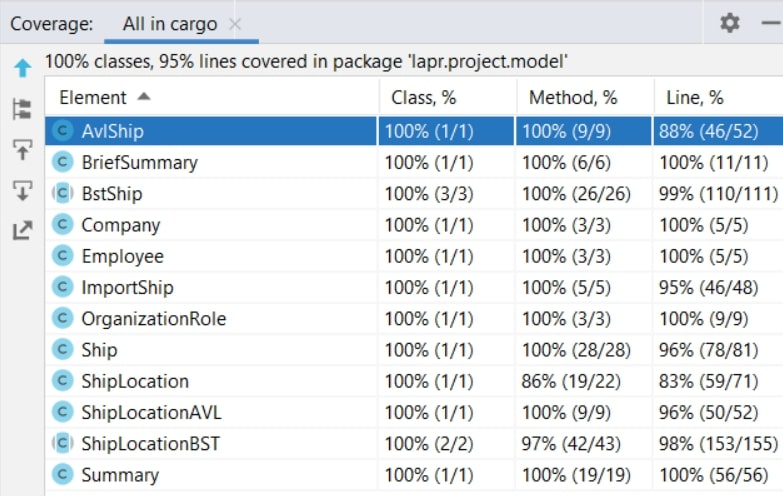
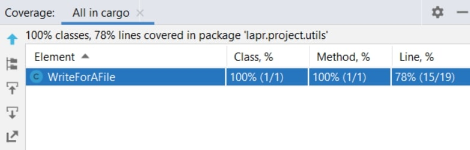

# LAPR3 - 2021/2022

-----------------------------


-----------------------------

#### Team Macchiato js _ Class DE:
* 1200720 _ Manuela Leite
* 1201239 _ Francisco Redol
* 1201382 _ Pedro Rocha
* 1201386 _ Rita Ariana Sobral

#### Teachers/Advisors:
* Nuno Bettencourt (NMB)
* José Marinho (JSM)
* António Silva Pereira (AMP)
* Orlando Sousa (OMS)
* Carlos Augusto Ramos (CAR)

#### Client:
* Nuno Bettencourt (NMB)

#### Course Unit:
* Laboratório/Projeto LAPR3

-----------------------------
# Document division

This document is divided in different categories, being them:

1. Report
   1. Problem Statement
   2. Project Division Organization
   3. Solution
   4. Software Engineering
      1. Use Case Diagram
      2. Domain Model
      3. Class Diagram (CD) for the whole project.
      4. For each US:
         1. Requirements Engineering:
            1. System Sequence Diagram (SSD).
         2. Engineering Analysis:
            1. Domain Model.
         3. Engineering Design
            1. Class Diagram (CD)
            2. Sequence Diagram (SD)
      5. Decision Making
      6. Complexity Analysis
   5. Coverage
      1. Project Coverage
      2. Pit Test Coverage Report
   6. Team Performance
2. README

-----------------------------

# Report

## Abstract

This project portraits everything the students learned during the semester and the results reflect the performance by each member of the team.

The project assignment presents the development of a software product for cargo shipping company to handle their logistics. This company operates through land and sea, across different
continents and has several warehouses spread along the world.

It was divided in 4 sprints to help us organize everything and each sprint had its own use cases.

## Introduction

This project has the goal to put into practice the good pratices learned on the differents course units: Applied Physics (FSIAP), Computer Architecture (ARQCP), Data
Structures (ESINF) and Databases (BDDAD), and Laboratory/Project III (LAPR3). An iterative and incremental process applies.

An agile methodology based on Scrum must be applied to manage each team’s work during each three-week sprint.

The main goal was to create a product that will be use to manage the logistics of a shipping company that operates across different continents through land and sea and the own several warehouses.

The software is developed in Java, and  some other software used for quick notifications should be developed in C/Assembly. The data should persist in a Database(SQL).


## Problem Statement
In response to LAPR3 Project Assignment, we had to develop a software for cargo shipping company to manage their logistics.
The company operates through land and sea, across different continents and has several warehouses spread along the world.
It should allow the Traffic Manager to import ships, see Ships's different data and create summary's.


##  Projet Division Organization
####  US101 - Francisco Redol
####  US102 - Pedro Rocha
####  US103 - Rita Ariana Sobral
####  US104 - Manuela Leite
####  US105 - Manuela Leite & Pedro Rocha
####  US106 - Rita Ariana Sobral & Francisco Redol
####  US107 - Manuela Leite, Francisco Redol, Pedro Rocha & Rita Ariana Sobral
####  US108 - Rita Ariana Sobral & Francisco Redol
####  US109 - Manuela Leite & Francisco Redol
####  US110 - Manuela Leite & Pedro Rocha
####  US111 - Rita Ariana Sobral & Pedro Rocha

## Solution

For LAPR3, the goal is to develop a software for a cargo shipping company to handle their logistics.

To reach this goal, we were instructed to adopt a Test-Driven-Development during the project, use Java, and follow an agile Scrum Methodology aswell as Jira.
We we're also required to apply the knowledge acquired in Information Structures and Database unit courses, in order to fully develop all the requested functionalities.

Jira was used to create issues and tasks, aswell as dividing them and planning each Sprint. Each user story was created and assigned to a team member(s), with focus on:
* Analysis, where it was developed the Use Case Diagram and the System Sequence Diagram.
* Design, where it was developed the Class Diagram, Sequence Diagram.
* Implementation, where code and test code were implemented.
* Review, where it was possible to review the entire implementation.

## Software 

[Use Case Diagram](https://bitbucket.org/lei-isep/lapr3-2021-g042/src/master/docs/UCD.svg)

[Domain Model](https://bitbucket.org/lei-isep/lapr3-2021-g042/src/master/docs/DM.svg)

[Class Diagram](https://bitbucket.org/lei-isep/lapr3-2021-g042/src/master/docs/CD.svg)


[US101](https://bitbucket.org/lei-isep/lapr3-2021-g042/src/master/docs/US101/US101.md)

[US102](https://bitbucket.org/lei-isep/lapr3-2021-g042/src/master/docs/US102/US102.md)

[US103](https://bitbucket.org/lei-isep/lapr3-2021-g042/src/master/docs/US103/US103.md)

[US104](https://bitbucket.org/lei-isep/lapr3-2021-g042/src/master/docs/US104/US104.md)

[US105](https://bitbucket.org/lei-isep/lapr3-2021-g042/src/master/docs/US105/US105.md)

[US106](https://bitbucket.org/lei-isep/lapr3-2021-g042/src/master/docs/US106/US106.md)

[US107](https://bitbucket.org/lei-isep/lapr3-2021-g042/src/master/docs/US107/US107.md)


#### Ship

* *MMSI:* According to the given Project Description, a Ship's MMSI code is characterized as a unique 9-digit ship identification code.
So, to verify if the inserted MMSI complies with the defined regulations, it is checked first if the given code's string is null or if its length is different than 9.
If so, an exception is thrown, and the object is not created since it does not meet the required criteria.

* *Name:* According to the given Project Description, a Ship's name does not have any length restriction.
However, to verify if the inserted name does meet the specified regulations, it firstly checked if the string containing is neither null nor empty.
If so, an exception is thrown, and the object is not created since it does not meet the criteria.

* *ShipID:* According to the given Project Description, a Ship's ID is a unique 7-digit international code.
To verify the inserted the code, the setShipID method verifies if either the string is null, has a length different than 10 (since it includes the IMO characters) and if the first 3 chars equal "IMO".
If so, an exception is thrown, and the object is not created since it does not meet the required criteria.

* *NumberGenerators* and *GeneratorOutput: * As a group, we thought that a ship could have 0 or more generators. However, we also agreed that we should not allow an object to be created with a generators number inferior to 0.

* *CallSign:* We verified if the string which possesses a ship's call sign was null or empty. If so, an exception is thrown so that the object is not created.

* *Cargo:* It is verified if the cargo string is null or empty. Then, if the string equals "NA", which means not available, the object's cargo is assigned as "NA". Otherwise, it is parsed and then, assigned to the object.

* *Length* and *Width:* Since a ship's dimensions are always bigger than 0, it is verified if both measurements comply with the specified criteria (dimensions>=0). If not, an IllegalArgumentException is thrown, and the objects creation shall not continue.

* *Draft:* Draft represents the distance between a ship's hull and the waterline. If it is lower than 0, it means the ship is out of water. So, if the received float which represents the draft is lower than 0, an exception is thrown.

#### ShipLocation

* *Latitude* and *Longitude:* According to the given Project Description, a ship's latitude and longitude should not be null nor empty. If the latitude equals 91 or longitude equals 181, respectively, those coordinates are set as "not available". Otherwise, if it exceeds the defined limits, an exception is thrown.

* *SOG:* If the shipLocation SOG is lower than 0, according to the project description rules, an exception is thrown.

* *COG:* If a COG is bigger or lower than 360 or 0, respectively, it is converted to the respective quadrant. If the inserted value is not valid, an exception is thrown.

* *Heading:* The Ship's heading could not be null nor empty. According to these rules and if it does not fit the [0,359] interval, an exception is thrown since the parameter does not comply with the rules.
If the value equals "511", it is set as "not available" and if the passes all conditions, it is set as the ShipLocation object heading.

* *StartBaseDate:* Its assumed that the starting position of a trip will be the first element of the Iterable returned by the InOrder() method of BSTShipPositions, since the tree will be organized by the ShipLocation date

* *EndBaseDate:* Its assumed that the final position of a trip will be the last element of the Iterable returned by the InOrder() method of BSTShipPositions because the tree will be organized by the date of the ShipLocation


## Project Coverage










## Pit Test Coverage Report


## Team Performance
The group agrees that all members of the group contributed equally to the project, althought some focused more on other parts given the division of the project.

-----------------
# README

This is the repository template used for student repositories in LAPR Projets.

## Java source files

Java source and test files are located in folder src.

## Maven file

Pom.xml file controls the project build.

### Notes
In this file, DO NOT EDIT the following elements:

* groupID
* artifactID
* version
* properties

Beside, students can only add dependencies to the specified section of this file.

## Eclipse files

The following files are solely used by Eclipse IDE:

* .classpath
* .project

## IntelliJ Idea IDE files

The following folder is solely used by Intellij Idea IDE :

* .idea

# How was the .gitignore file generated?
.gitignore file was generated based on https://www.gitignore.io/ with the following keywords:

- Java
- Maven
- Eclipse
- NetBeans
- Intellij

# Who do I talk to?
In case you have any problem, please email Nuno Bettencourt (nmb@isep.ipp.pt).

# How do I use Maven?

## How to run unit tests?

Execute the "test" goals.

```shell
$ mvn test
```
## How to generate the javadoc for source code?

Execute the "javadoc:javadoc" goal.

```shell
$ mvn javadoc:javadoc
```
This generates the source code javadoc in folder "target/site/apidocs/index.html".

## How to generate the javadoc for test cases code?

Execute the "javadoc:test-javadoc" goal.

```shell
$ mvn javadoc:test-javadoc
```
This generates the test cases javadoc in folder "target/site/testapidocs/index.html".

## How to generate Jacoco's Code Coverage Report?

Execute the "jacoco:report" goal.

```shell
$ mvn test jacoco:report
```

This generates a jacoco code coverage report in folder "target/site/jacoco/index.html".

## How to generate PIT Mutation Code Coverage?

Execute the "org.pitest:pitest-maven:mutationCoverage" goal.

```shell
$ mvn test org.pitest:pitest-maven:mutationCoverage
```
This generates a PIT Mutation coverage report in folder "target/pit-reports/YYYYMMDDHHMI".

## How to combine different maven goals in one step?

You can combine different maven goals in the same command. For example, to locally run your project just like on jenkins, use:

```shell
$ mvn clean test jacoco:report org.pitest:pitest-maven:mutationCoverage
```
## How to perform a faster pit mutation analysis?

Do not clean build => remove "clean"

Reuse the previous report => add "-Dsonar.pitest.mode=reuseReport"

Use more threads to perform the analysis. The number is dependent on each computer CPU => add "-Dthreads=4"

Temporarily remove timestamps from reports.

Example:
```shell
$ mvn test jacoco:report org.pitest:pitest-maven:mutationCoverage -DhistoryInputFile=target/fasterPitMutationTesting-history.txt -DhistoryOutputFile=target/fasterPitMutationTesting-history.txt -Dsonar.pitest.mode=reuseReport -Dthreads=4 -DtimestampedReports=false
```
## Where do I configure my database connection?

Each group should configure their database connection on the file:
* src/main/resources/application.properties