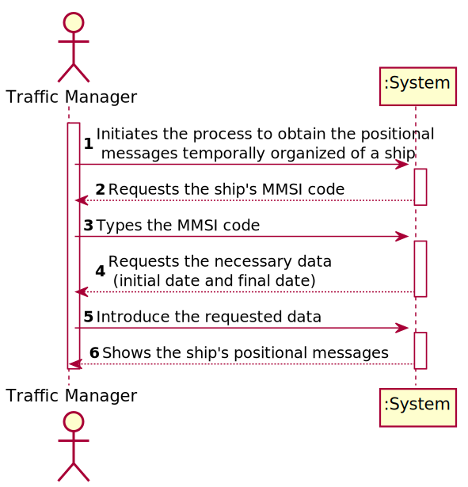
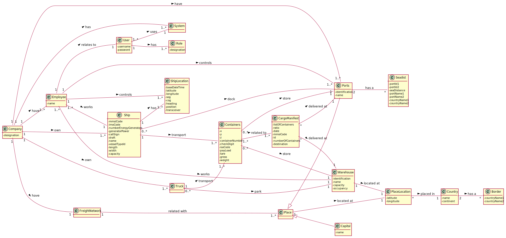
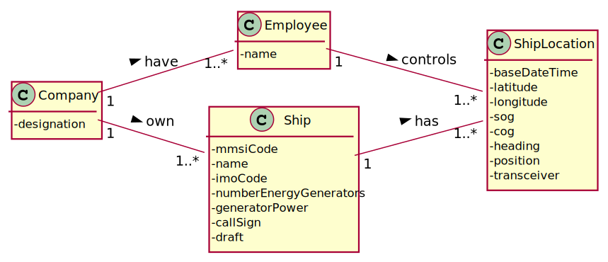
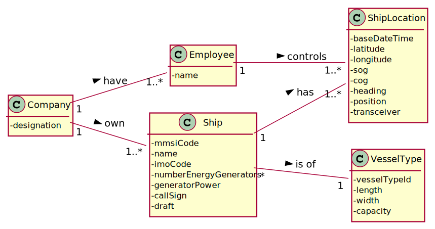
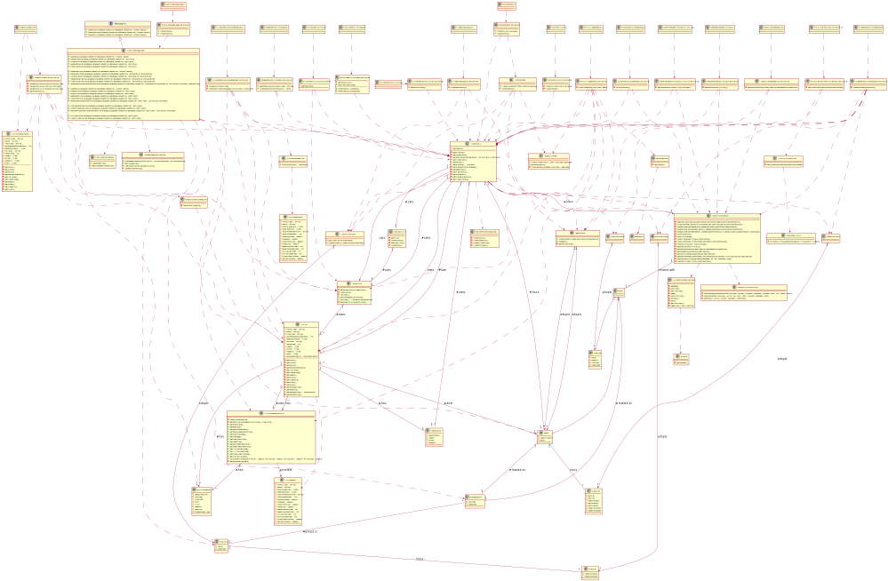
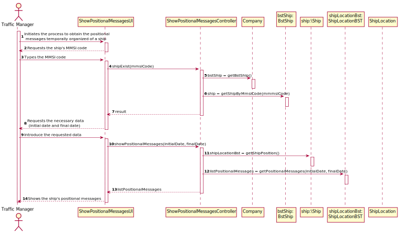
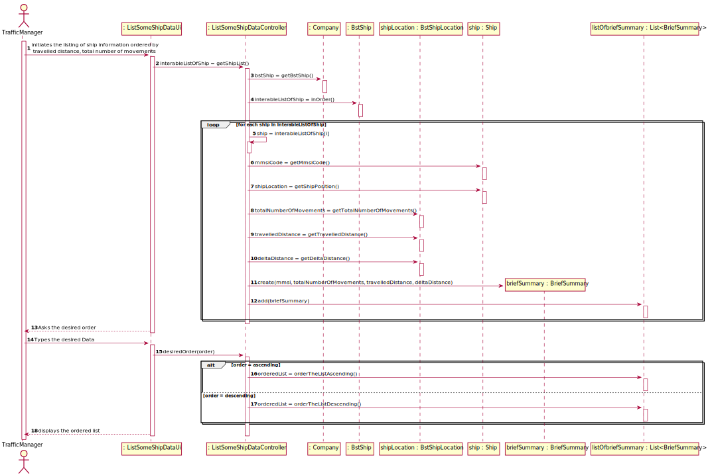
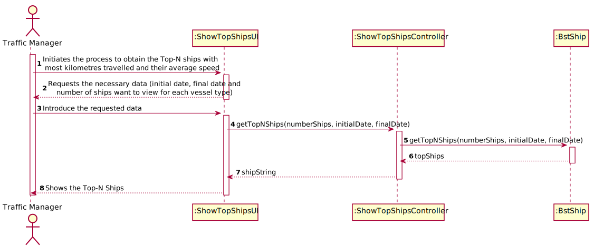

# <span style="color:darkcyan"> REPORT

# <span style="color:LightCyan"> Project Report LAPR3


#### <span style="color:skyblue"> Team Macchiato js _ Class DE:

* 1200720 _ Manuela Leite
* 1201239 _ Francisco Redol
* 1201382 _ Pedro Rocha
* 1201386 _ Rita Ariana Sobral

#### <span style="color:skyblue"> Teachers/Advisors:

* Nuno Bettencourt (NMB)
* José Marinho (JSM)
* António Silva Pereira (AMP)
* Orlando Sousa (OMS)
* Carlos Augusto Ramos (CAR)

#### <span style="color:skyblue"> Client:

* Nuno Bettencourt (NMB)

#### <span style="color:skyblue"> Course Unit:

* Laboratório/Projeto LAPR3

## <span style="color:LightCyan"> Abstract

* This project portraits everything the students learned during the semester and the results reflect the performance by each member of the team.
* The project assignment presents the development of a software product for cargo shipping company to handle their logistics. This company operates through land and sea, across different
  continents and has several warehouses spread along the world.
* It was divided in 4 sprints to help us organize everything and each sprint had its own use cases.

## <span style="color:LightCyan"> Introduction

* This project has the goal to put into practice the good pratices learned on the differents course units: Applied Physics (FSIAP), Computer Architecture (ARQCP), Data
  Structures (ESINF) and Databases (BDDAD), and Laboratory/Project III (LAPR3). An iterative and incremental process applies.
* An agile methodology based on Scrum must be applied to manage each team’s work during each three-week sprint.

* The main goal was to create a product that will be use to manage the logistics of a shipping company that operates across different continents through land and sea and the own several warehouses.
  It should allow the Traffic Manager to import ships, see Ships's different data and create summary's.

* The software is developed in Java, and  some other software used for quick notifications should be developed in C/Assembly.

* This report is divided in different categories, being them:
    1. Problem Statement
    2. Project Division Organization
    3. Requirements Engineering:
       1. System Sequence Diagram (SSD) for each user story.
    4. Engineering Analysis:
        1. Domain Model (whole project)
           1. Excerpts of each User Story.
    5. Engineering Design
       1. Class Diagram (CD) for the whole project.
          1. Excerpts of each user story
       2. Sequence Diagram (SD) for each user story
       3. Relational Model (Normalised) for the whole project
    6. Project Coverage
    7. Pit Test Coverage Report
    8. Team Performance

## <span style="color:LightCyan"> Problem Statement

## <span style="color:LightCyan"> Projet Division Organization

## <span style="color:LightCyan"> Requirements Engineering
#### <span style="color:skyblue"> System Sequence Diagram (SSD) for each user story
###### <span style="color:steelblue">   US101 - SSD

###### <span style="color:steelblue">   US102 - SSD

###### <span style="color:steelblue">   US103 - SSD

###### <span style="color:steelblue">   US104 - SSD

###### <span style="color:steelblue">   US105 - SSD

###### <span style="color:steelblue">   US106 - SSD

###### <span style="color:steelblue">   US107 - SSD

## <span style="color:LightCyan"> Engineering Analysis:
#### <span style="color:skyblue">  Domain Model (whole project)

###### <span style="color:steelblue">   Excerpts of each User Story
###### <span style="color:steelblue">   US101 - DM

###### <span style="color:steelblue">   US102 - DM

###### <span style="color:steelblue">   US103 - DM

###### <span style="color:steelblue">   US104 - DM

###### <span style="color:steelblue">   US105 - DM

###### <span style="color:steelblue">   US106 - DM

###### <span style="color:steelblue">   US107 - DM


## <span style="color:LightCyan"> Engineering Design
#### <span style="color:skyblue"> Class Diagram (CD) for the whole project.

###### <span style="color:steelblue">   Excerpts of each user story
###### <span style="color:steelblue">   US101 - CD

###### <span style="color:steelblue">   US102 - CD

###### <span style="color:steelblue">   US103 - CD

###### <span style="color:steelblue">   US104 - CD

###### <span style="color:steelblue">   US105 - CD

###### <span style="color:steelblue">   US106 - CD

###### <span style="color:steelblue">   US107 - CD


#### <span style="color:skyblue"> Sequence Diagram (SD) for each user story
###### <span style="color:steelblue">   US101 - SD

###### <span style="color:steelblue">   US102 - SD

###### <span style="color:steelblue">   US103 - SD

###### <span style="color:steelblue">   US104 - SD

###### <span style="color:steelblue">   US105 - SD

###### <span style="color:steelblue">   US106 - SD

###### <span style="color:steelblue">   US107 - SD


#### <span style="color:skyblue"> Relational Model (Normalised) for the whole project

## <span style="color:LightCyan"> Project Coverage

## <span style="color:LightCyan"> Pit Test Coverage Report

## <span style="color:LightCyan"> Team Performance

# README

This is the repository template used for student repositories in LAPR Projets.

## Java source files

Java source and test files are located in folder src.

## Maven file

Pom.xml file controls the project build.

### Notes
In this file, DO NOT EDIT the following elements:

* groupID
* artifactID
* version
* properties

Beside, students can only add dependencies to the specified section of this file.

## Eclipse files

The following files are solely used by Eclipse IDE:

* .classpath
* .project

## IntelliJ Idea IDE files

The following folder is solely used by Intellij Idea IDE :

* .idea

# How was the .gitignore file generated?
.gitignore file was generated based on https://www.gitignore.io/ with the following keywords:

  - Java
  - Maven
  - Eclipse
  - NetBeans
  - Intellij

# Who do I talk to?
In case you have any problem, please email Nuno Bettencourt (nmb@isep.ipp.pt).

# How do I use Maven?

## How to run unit tests?

Execute the "test" goals.

```shell
$ mvn test
```
## How to generate the javadoc for source code?

Execute the "javadoc:javadoc" goal.

```shell
$ mvn javadoc:javadoc
```
This generates the source code javadoc in folder "target/site/apidocs/index.html".

## How to generate the javadoc for test cases code?

Execute the "javadoc:test-javadoc" goal.

```shell
$ mvn javadoc:test-javadoc
```
This generates the test cases javadoc in folder "target/site/testapidocs/index.html".

## How to generate Jacoco's Code Coverage Report?

Execute the "jacoco:report" goal.

```shell
$ mvn test jacoco:report
```

This generates a jacoco code coverage report in folder "target/site/jacoco/index.html".

## How to generate PIT Mutation Code Coverage?

Execute the "org.pitest:pitest-maven:mutationCoverage" goal.

```shell
$ mvn test org.pitest:pitest-maven:mutationCoverage
```
This generates a PIT Mutation coverage report in folder "target/pit-reports/YYYYMMDDHHMI".

## How to combine different maven goals in one step?

You can combine different maven goals in the same command. For example, to locally run your project just like on jenkins, use:

```shell
$ mvn clean test jacoco:report org.pitest:pitest-maven:mutationCoverage
```
## How to perform a faster pit mutation analysis?

Do not clean build => remove "clean"

Reuse the previous report => add "-Dsonar.pitest.mode=reuseReport"

Use more threads to perform the analysis. The number is dependent on each computer CPU => add "-Dthreads=4"

Temporarily remove timestamps from reports.

Example:
```shell
$ mvn test jacoco:report org.pitest:pitest-maven:mutationCoverage -DhistoryInputFile=target/fasterPitMutationTesting-history.txt -DhistoryOutputFile=target/fasterPitMutationTesting-history.txt -Dsonar.pitest.mode=reuseReport -Dthreads=4 -DtimestampedReports=false
```
## Where do I configure my database connection?

Each group should configure their database connection on the file:
* src/main/resources/application.properties