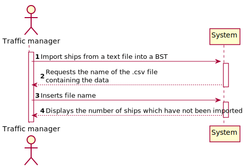
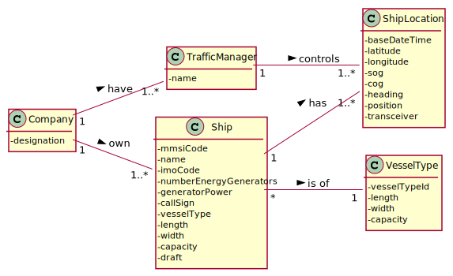
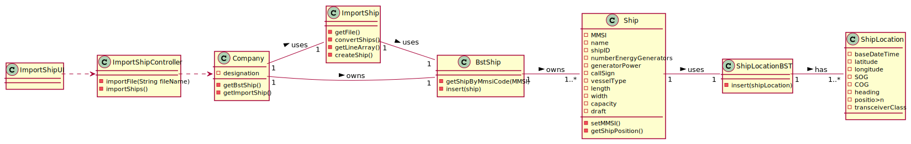
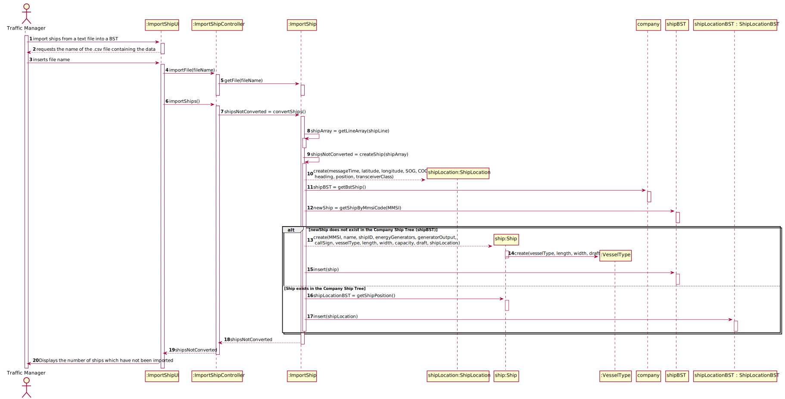

## US101 - As a traffic manager, I which to import ships from a text file into a BST.

## *Requirements Engineering*
#### SSD - System Sequence Diagram

#### DM - Domain Model

#### CD - Class Diagram

#### SD - Sequence Diagram

## *Decision Making*
BST & AVL – These are data storage and organization structures that benefit from less time complexity in carrying out operations such as reading, searching, insertion and removal.
The project statement allowed us to know in advance that the company we are developing software for would need to store a vast number of ships and their locations in a first phase, however, using information structures such as arrays and Arraylist, time performance of certain functions would be noticeably higher since these structures have a temporal complexity for the operations mentioned above.
Thus, to maximize the efficiency of the system's functionalities, we use binary trees.
The previously mentioned structures can be found in the storage of ships in the system as well as in the individual storage of each ship's positions.

## *Complexity Analysis*
Concretely analysing the complexity of the algorithm related to US101 (convertShips())
using the measure of time (temporal complexity) we conclude that the algorithm has
polynomial complexity of degree 1 (O(n)).
The for loop is executed n times plus one(O(n+1)), this last time being the loop condition
checking (and failure), as readFile will read n lines from the input file. The remaining lines
are of O (1) complexity.