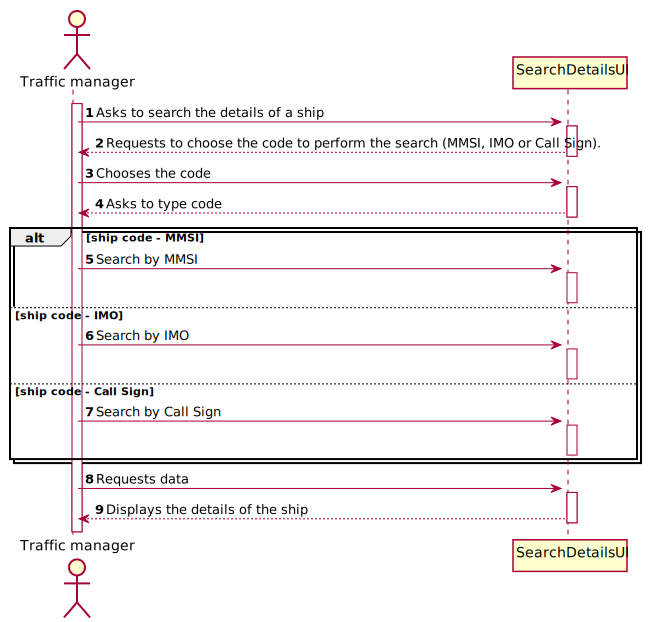
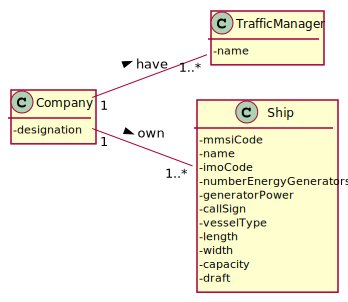

#US102 - As a traffic manager I which to search the details of a ship using any of its codes: MMSI, IMO or Call Sign

## *Requirements Engineering*
#### SSD - System Sequence Diagram

#### DM - Domain Model

#### CD - Class Diagram

#### SD - Sequence Diagram

## *Decision Making*
With the knowledge we had to date, the group decided to not develop the three trees in order not to be tripling the system information, despite the search for the imo and the callsign not being the most efficient as if it existed in the trees. We do the efficient search by mmsi and then we choose to do it by inOrder () to run the whole tree looking for the ship.

