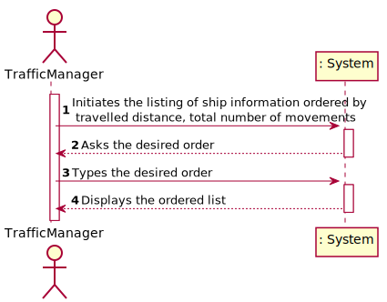
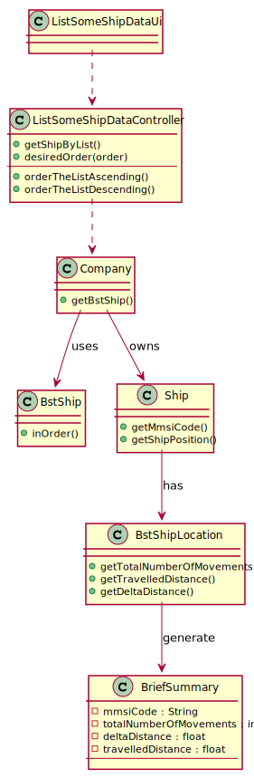

#US105 - As a traffic manager I which to list for all ships the MMSI, the total number of movements, Travelled Distance and Delta Distance
## *Requirements Engineering*
#### SSD - System Sequence Diagram

#### DM - Domain Model

#### CD - Class Diagram

#### SD - Sequence Diagram

## *Decision Making*
We chose to create a class that grouped the attributes necessary to satisfy the request in the US and to be able to implement the Interface comparator in this class for a better organization of the lists.

