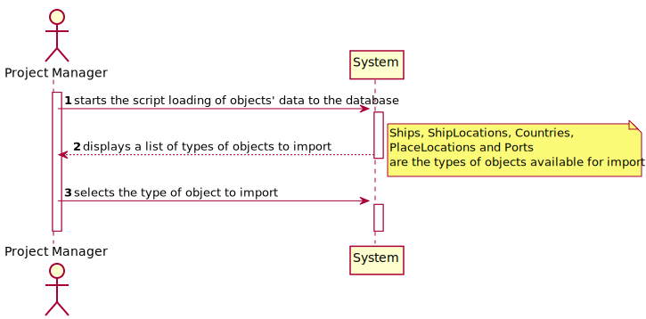
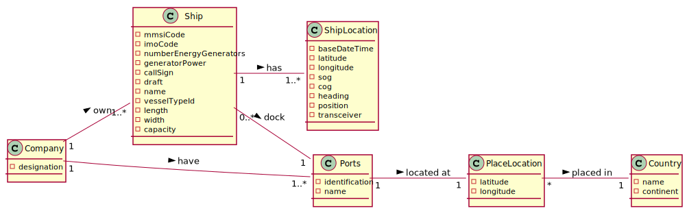
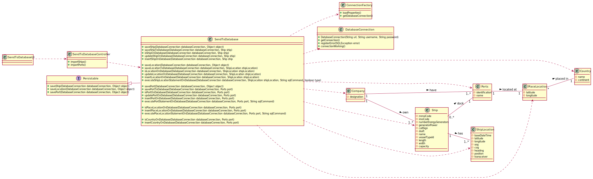
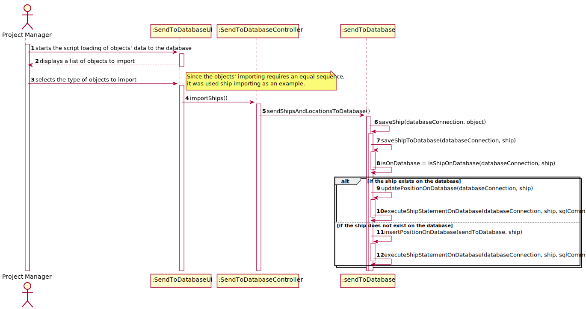

## US111 -  As Project Manager, I want the team to create a SQL script to load the databasewith a minimum set of data sufficient to carry out data integrity verification and functional testing.This script shall produce a bootstrap report providing the number of tuples/rowsin each relation/table.

## *Requirements Engineering*
#### SSD - System Sequence Diagram

#### DM - Domain Model

#### CD - Class Diagram

#### SD - Sequence Diagram

## *Decision Making*

No decorrer da US111, foram efetuadas diversas escolhas, de forma a assegurar o correto funcionamento do código.

Assim, usaram-se objetos DatabaseConnection, PreparedStatement, ResultSet, entre outros.

De forma a permitir a inserção adequada dos dados na base de dados, efetuou-se uma sequência simples para evitar o surgimento de erros relacionados com a inserção e manipulação de dados.

Determinou-se que primeiro seriam invocadas as funções que verificam se existe uma determinada linha de dados dentro de uma determinada table.

Caso essa condição seja verdadeira, os dados da mesma, serão atualizados. Caso não seja, essa linha será inteiramente inserida.

De forma a modularizar e permitir o melhor manuseamento, interpretação e manutenção do código, estas funções foram divididas em 4 métodos principais.

Por exemplo, no caso de um objeto navio. O método saveShipToDatabase, coordena a verificação da existência de uma determinada linha, a atualização da linha e a inserção de uma nova. Isto, graças aos métodos isShipOnDatabase, updateShipOnDatabase e insertShipOnDatabase, respetivamente.

Para os objetos, ShipLocation e Ports, a estrutura decidida é semelhante.

Contudo, para efetuar a inserção de Ports, é necessário que os objetos PlaceLocation e Country sejam inseridos antes na base de dados. A sequência de introdução é semelhante e requerida para que seja possível efetuar a tal operação.