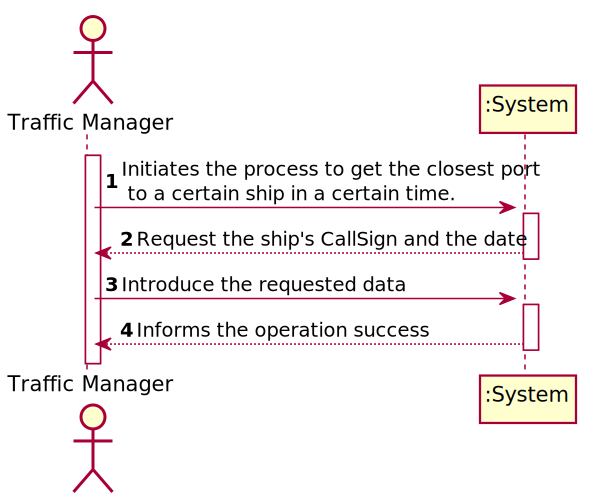
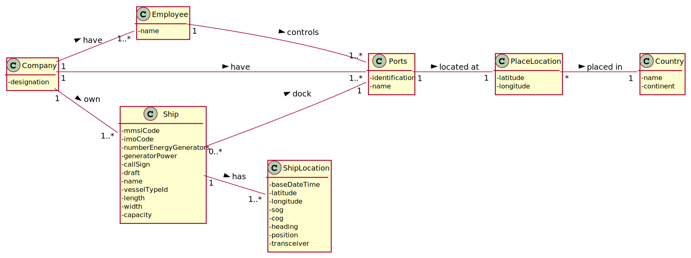
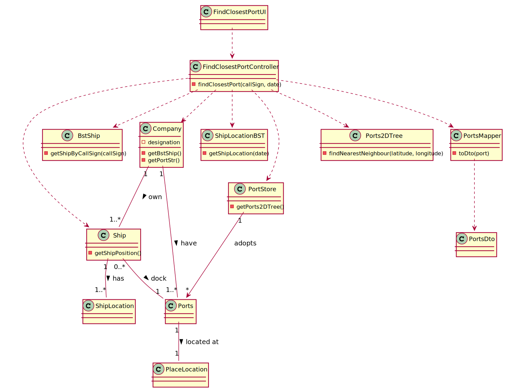
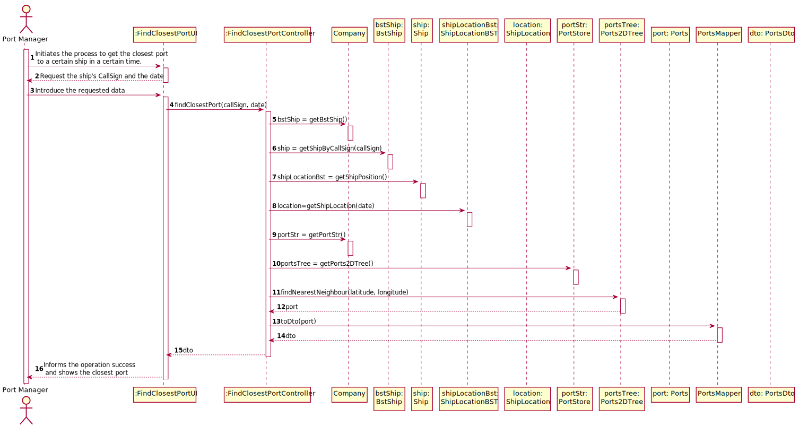

## US202 - As a Traffic manager, I which to find the closest port of a ship given its CallSign, on a certain DateTime.

## *Requirements Engineering*
#### SSD - System Sequence Diagram

#### DM - Domain Model

#### CD - Class Diagram

#### SD - Sequence Diagram

## *Decision Making*

Translating KDTree's qualities to our business context, one of its assets is, in a huge list of available ports, it is easy to find the closest port (through its latitude and longitude).

## *Complexity Analysis*

Concretely analysing the complexity of the algorithm related to US202
(findNearestNeighbour(latitude,longitude)) using the measure of time (temporal complexity) we
conclude that the algorithm has logarithmic complexity (O(n)).

