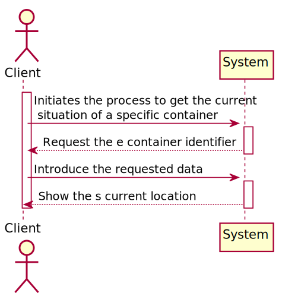
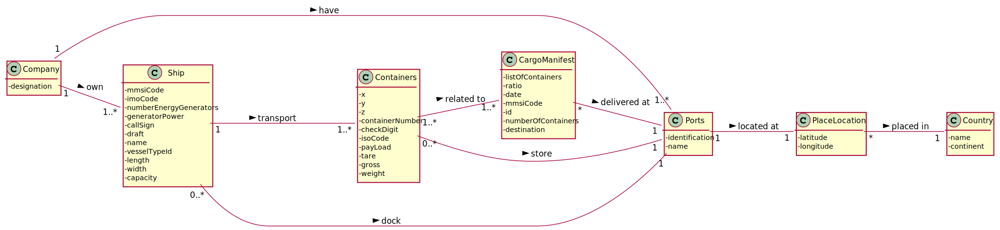
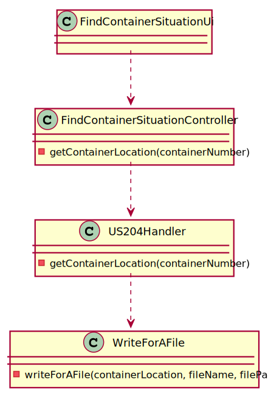
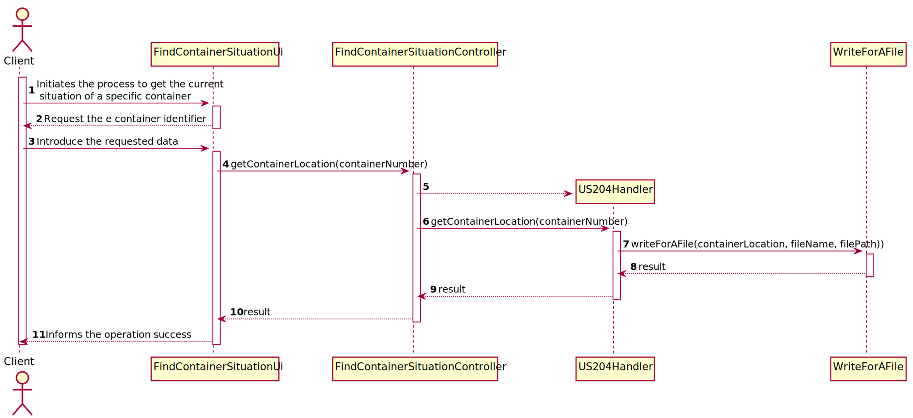

## US204 - As Client, I want to know the current situation of a specific container being used to transport my goods
## *Requirements Engineering*
#### SSD - System Sequence Diagram

#### DM - Domain Model

#### CD - Class Diagram

#### SD - Sequence Diagram

## *Decision Making*

## *Script Analysis*

Primeiro, foi criado um cursor para iterar todo o CargoManifestContainer onde o atributo containerNumberId é igual ao container identifier dado pelo cliente para obtermos todos os id de cargoManifestLoad em que o contentor estava incluído.

Posteriormente, iteramos por todos os cargosManifestsLoadId, para obtermos caso exista o respetivo cargoManifestUnloadId.

Caso o respetivo cargoManifestUnloadId seja NULL quer dizer que o contentor está a ser transportado por um navio até ao respetivo porto, e como o contentor só pode estar a ser transportado por um barco de cada vez só pode existir um cargoManifestLoad nesta situação.

Para saber em que navio o contentor do cliente está a ser transportado obtemos o shipMmsiCode presente no cargoManifestLoad respetivo e com o shipMmsiCode conseguimos obter o nome do navio para informar o cliente.

Caso o contentor em questão esteja no navio a função termina a sua execução.

Caso não exista nenhum cargoManifestUnloadId a NULL é sinal que o container se encontra num porto. Posto isto temos que saber qual foi o último porto a que chegou, e sabemos isto com a realDataArrival que se encontra na classe phases.

Para obter a respetiva tabela phases e conseguir saber a realDataArrival e qual era o seu porto de destino recorro ao atributo phasesId de cargoManifestUnload.

Como vou comparando todos as datas e guardando a mais recente e o respetivo destino, no final do loop a variável v_locationName tem o nome do porto em que o contentor se encontra. 

