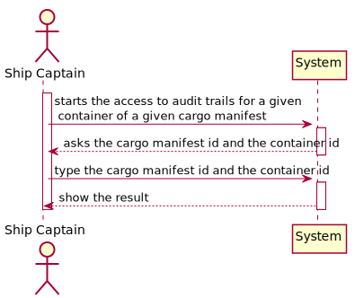
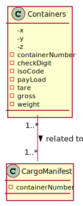
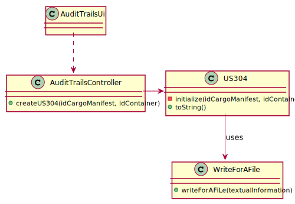
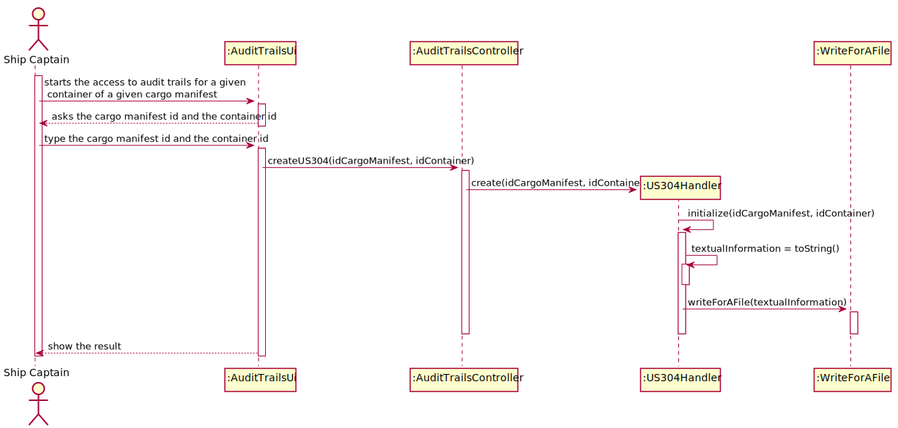

## US304 - As Ship Captain, I want to have access to audit trails for a given container of a given cargo manifest, that is, I want to have access to a list of all operations performed on a given container of a given manifest, in chronological order. For each operation I want to know: the user/login that performed it, the date and time the operation was performed,the type of operation (INSERT, UPDATE, DELETE), the container identifier and the cargo manifest identifier.
## *Requirements Engineering*
#### SSD - System Sequence Diagram

#### DM - Domain Model

#### CD - Class Diagram

#### SD - Sequence Diagram

## *Script Analysis*