## US305 - As Client, I want to know the route of a specific container I am leasing.
## *Requirements Engineering*
#### SSD - System Sequence Diagram
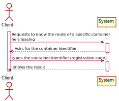
#### DM - Domain Model
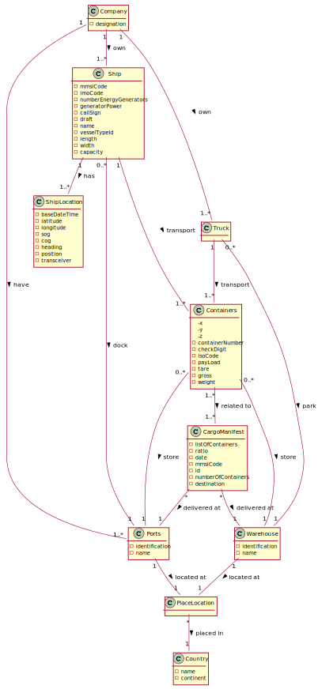
#### CD - Class Diagram
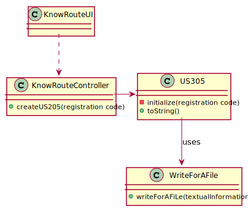
#### SD - Sequence Diagram
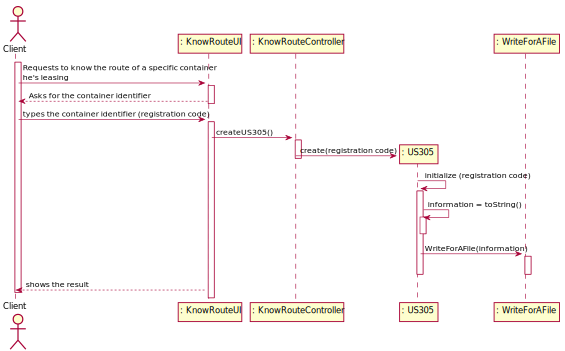

## *Script Analysis*
#### 1. O Script receberá por parâmetro o “registrationCode”, isto é, o identificador do contentor e retornará uma String que conterá as informações desejadas sobre o percurso do respetivo contentor. Foram declaradas as variáveis demonstradas na figura seguinte.

#### 2. O Cursor será responsável por iterar os Cargo Manifests Load cujo contentor está inserido.
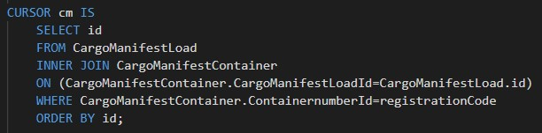

#### 3. É necessário obter a informação da "fase atual" assim como o primeiro meio de transporte para dar início ao ciclo que irá trabalhar o percurso do contentor.
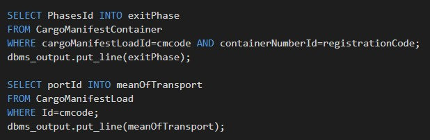

#### 4. Até se alcançar a "fase atual" procede-se à listagem das informações referentes a cada fase, ou seja, par de portos onde o contentor esteve - origem, destino, data de partida e de chegada.
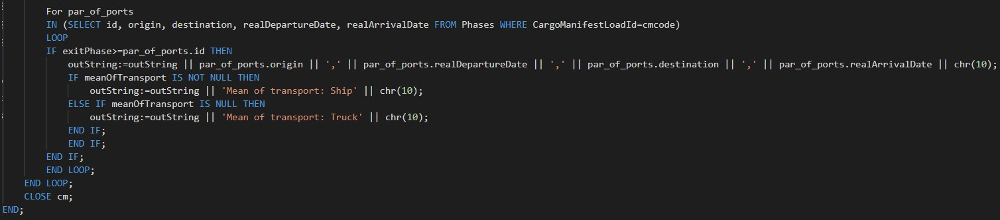

## *Script Outputs Confirmation*
#### De forma a se proceder à confirmação dos outputs, procedeu-se ao exemplo do contentor com o id 213456782 que parte de Valencia (02/10/21) chegando a Callao (15/10/21), partindo posteriormente de Callao (17/10/21) rumo a Matarani (30/10/21).
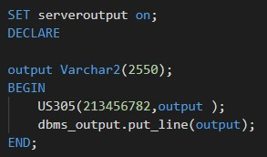
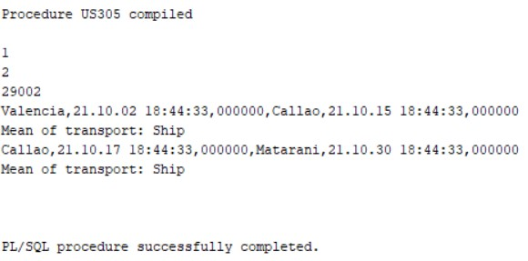
###### Phases
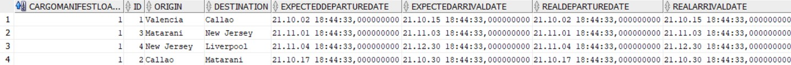
###### CargoManifestCotainer
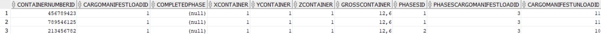
###### CargoManifestLoads
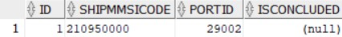
