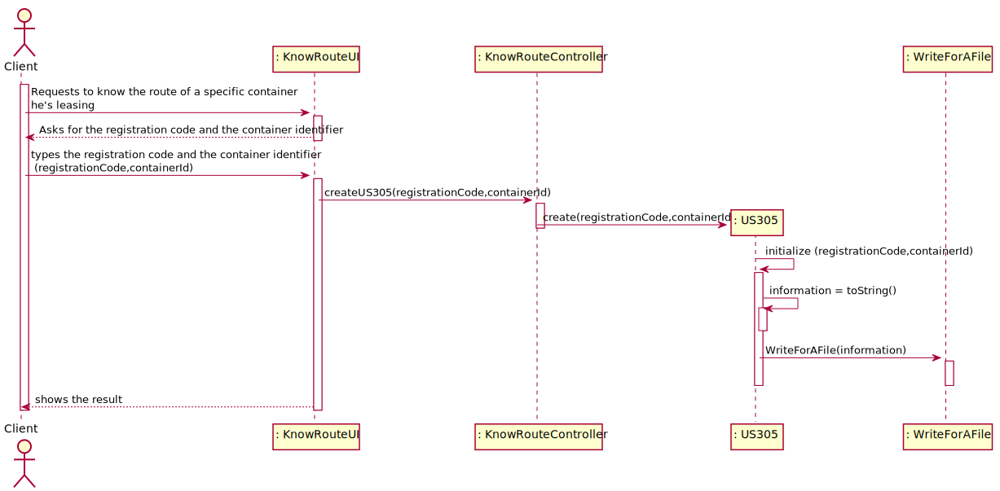

## US305 - As Client, I want to know the route of a specific container I am leasing.
## *Requirements Engineering*
#### SSD - System Sequence Diagram

#### DM - Domain Model

#### CD - Class Diagram

#### SD - Sequence Diagram

## *Script Analysis*
