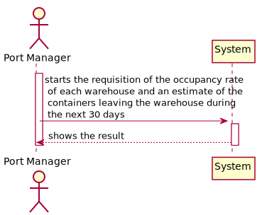
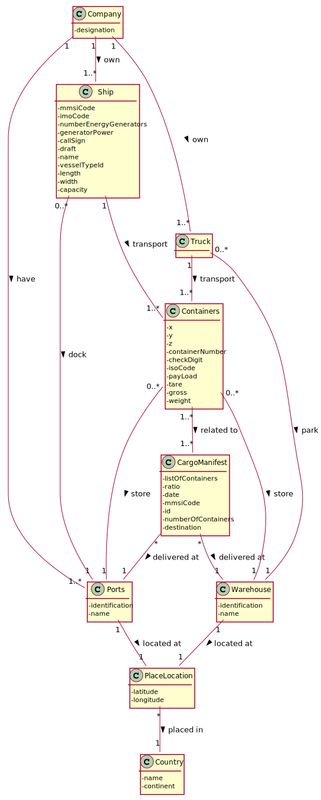
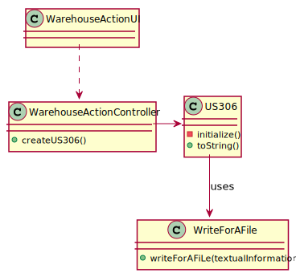
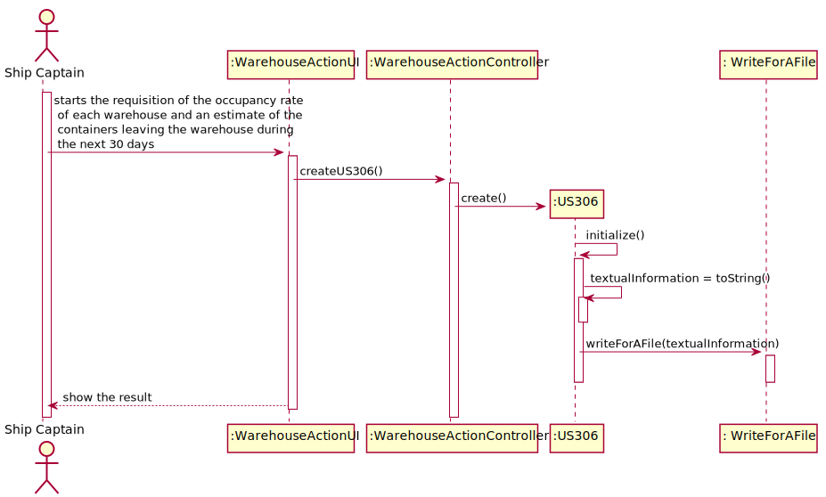

## US306 - As Port manager, I want to know the occupancy rate of each warehouse and an estimate of the containers leaving the warehouse during the next 30 days.

## *Requirements Engineering*
#### SSD - System Sequence Diagram

#### DM - Domain Model

#### CD - Class Diagram

#### SD - Sequence Diagram

## *Script Analysis*

## *Script Outputs Confirmation*
