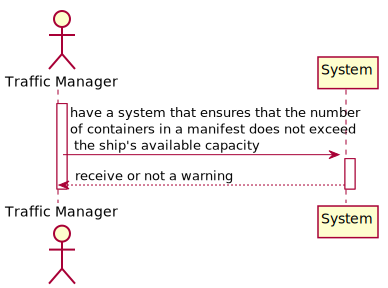
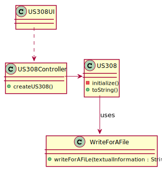
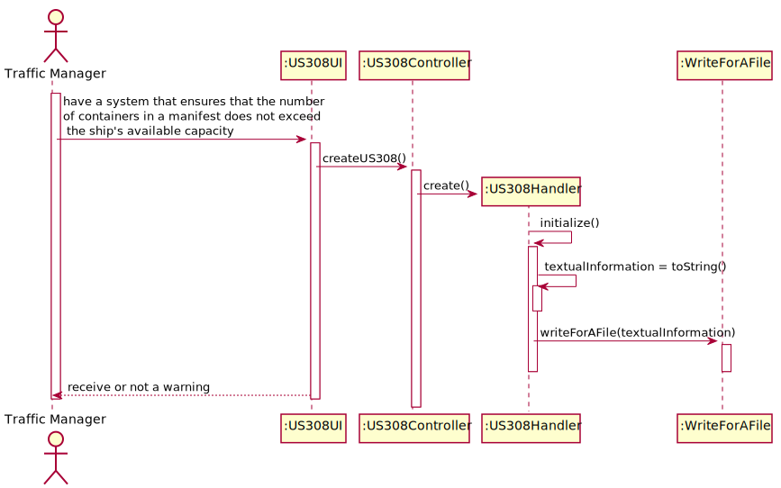

## US308 - As Traffic manager, I want to have a system that ensures that the number of containers in a manifest does not exceed the ship's available capacity.

## *Requirements Engineering*
#### SSD - System Sequence Diagram

#### DM - Domain Model

#### CD - Class Diagram

#### SD - Sequence Diagram

## *Script Analysis*