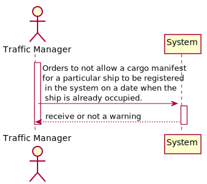
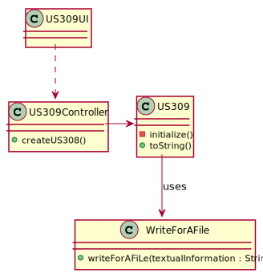
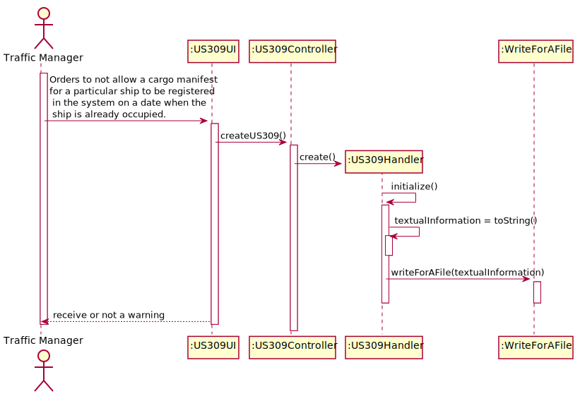

## US309 - As Traffic manager, I do not allow a cargo manifest for a particular ship to be registered in the system on a date when the ship is already occupied.

## *Requirements Engineering*
#### SSD - System Sequence Diagram

#### DM - Domain Model

#### CD - Class Diagram

#### SD - Sequence Diagram

## *Script Analysis*