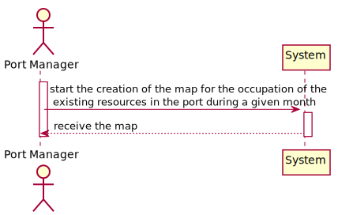
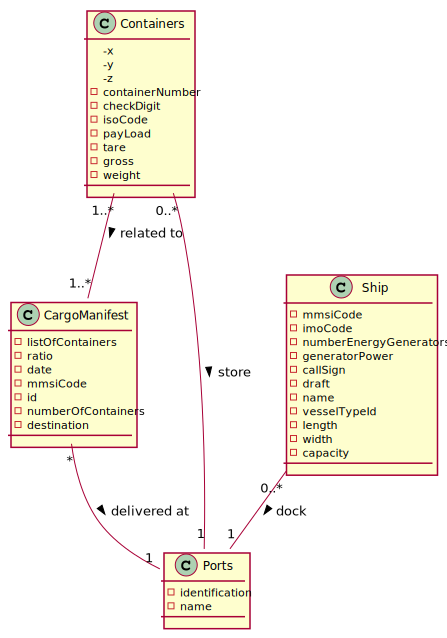
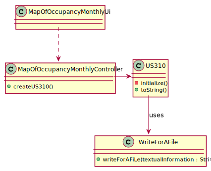
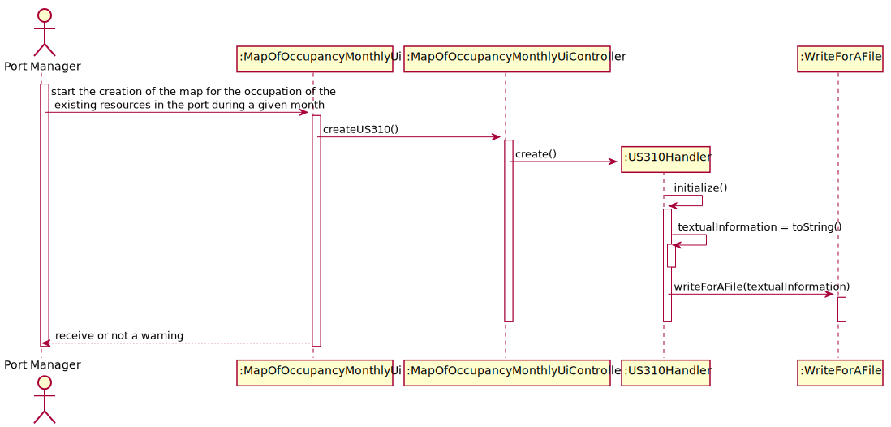

## US310 As Port manager, I intend to have a map of the occupation of the existing resources in the port during a given month.

## *Requirements Engineering*
#### SSD - System Sequence Diagram

#### DM - Domain Model

#### CD - Class Diagram

#### SD - Sequence Diagram

## *Script Analysis*