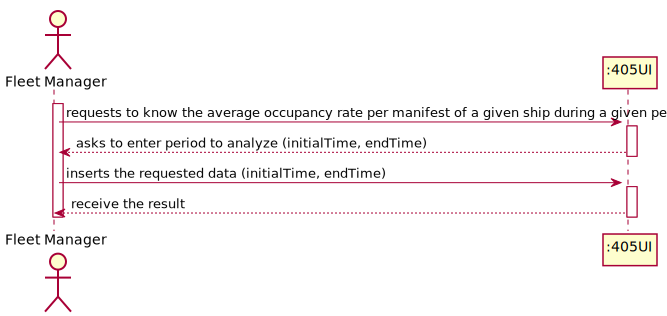
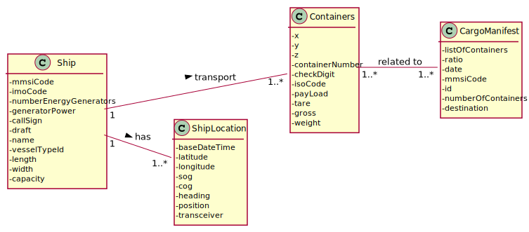
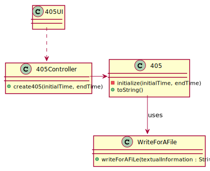
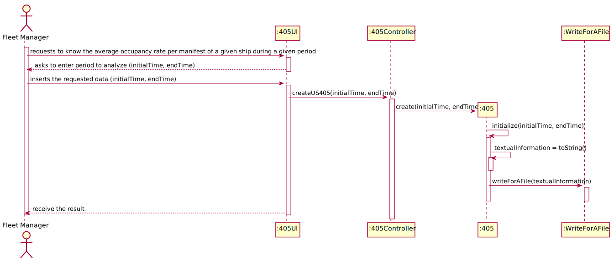

## US405 - As Fleet Manager, I want to know the average occupancy rate per manifest of a given ship during a given period.

## *Requirements Engineering*
#### SSD - System Sequence Diagram

#### DM - Domain Model

#### CD - Class Diagram

#### SD - Sequence Diagram

## *Script Analysis*

## *Script Outputs Confirmation*
