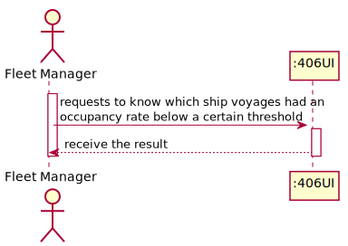
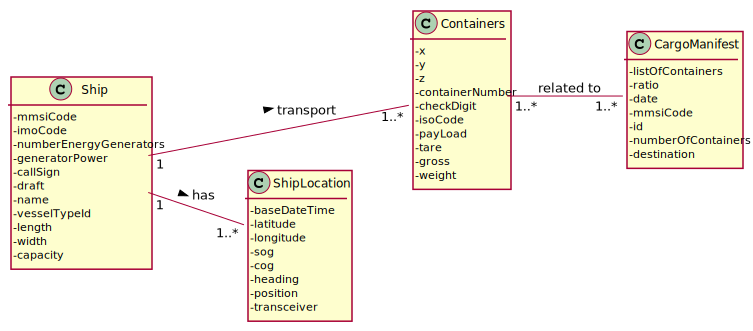
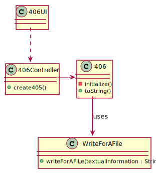
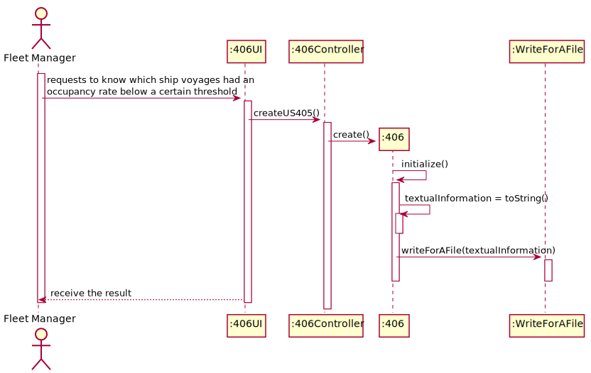

## US406 - As Fleet Manager, I want to know which ship voyages – place and date of origin and destination – had an occupancy rate below a certain threshold; by default, consider an occupancy rate threshold of 66%. Only the trips already concluded are to be considered.
## *Requirements Engineering*
#### SSD - System Sequence Diagram

#### DM - Domain Model

#### CD - Class Diagram

#### SD - Sequence Diagram

## *Script Analysis*

## *Script Outputs Confirmation*
